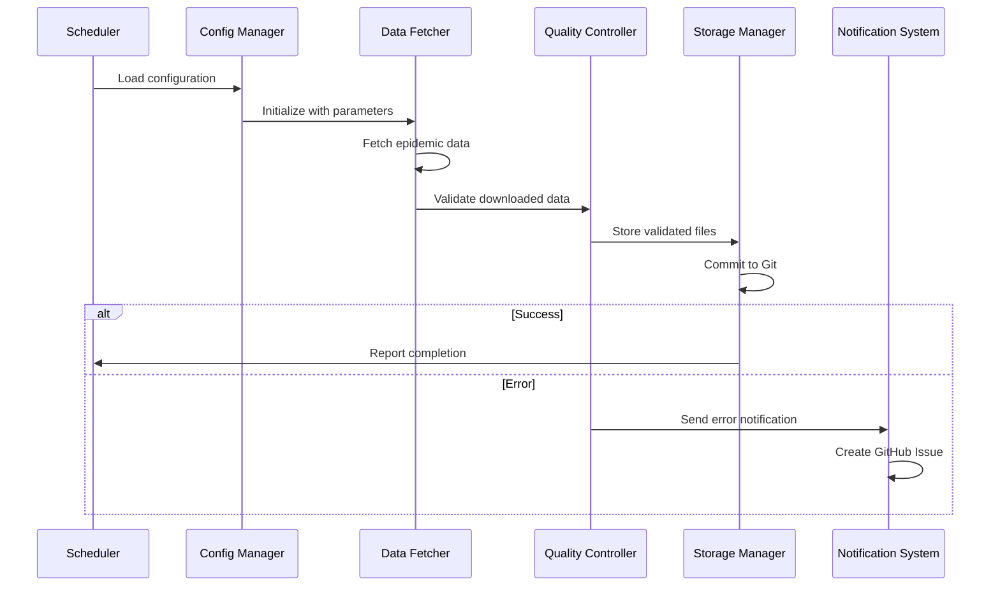

# Design Document

## Overview

東京都感染症発生動向情報の自動データ収集システムは、既存のTokyoEpidemicSurveillanceFetcherクラスを中核として、GitHub Actionsによるスケジュール実行、エラーハンドリング、データ品質管理、自動Git管理を統合したシステムです。

システムは以下の主要コンポーネントで構成されます：
- **Data Fetcher**: 既存のTokyoEpidemicSurveillanceFetcherを拡張したデータ取得エンジン
- **Scheduler**: GitHub Actionsベースのスケジューリングシステム
- **Storage Manager**: ファイル管理とGit操作を担当
- **Quality Controller**: データ検証と品質管理
- **Notification System**: エラー通知とアラート管理
- **Configuration Manager**: 設定ファイルとパラメータ管理
- **Monitoring System**: システム監視とメトリクス収集

### Key Design Decisions

1. **既存コードの活用**: TokyoEpidemicSurveillanceFetcherクラスを継承・拡張し、既存の実装を最大限活用
2. **GitHub Actions中心設計**: CI/CDプラットフォームの制約（実行時間制限、リソース制限）を考慮した設計
3. **ファイルベース状態管理**: データベース不要で、ファイルシステムとGitによる状態管理
4. **段階的データ収集**: 大量の履歴データを効率的に処理するための分割実行戦略

## Architecture

### System Architecture

```mermaid
graph TB
    subgraph "GitHub Actions Environment"
        A[Scheduler] --> B[Configuration Manager]
        B --> C[Data Fetcher]
        C --> D[Quality Controller]
        D --> E[Storage Manager]
        E --> F[Notification System]
    end
    
    subgraph "External Systems"
        G[Tokyo Metropolitan Government API]
        H[GitHub Repository]
        I[GitHub Issues API]
    end
    
    C --> G
    E --> H
    F --> I
    
    subgraph "Data Flow"
        J[CSV Files] --> K[Metadata Logs]
        K --> L[Git Commits]
    end
    
    E --> J
    E --> K
    E --> L

### GitHub Actions Workflow Design

```yaml
# .github/workflows/data-collection.yml の概要
name: Tokyo Epidemic Data Collection
on:
  schedule:
    - cron: '0 2 * * 1'  # 毎週月曜日 2:00 AM JST
  workflow_dispatch:     # 手動実行
    inputs:
      date_range:
        description: 'Date range (YYYY-MM-DD to YYYY-MM-DD)'
        required: false
      data_types:
        description: 'Comma-separated data types'
        required: false

jobs:
  collect-data:
    runs-on: ubuntu-latest
    timeout-minutes: 360  # 6時間制限
    steps:
      - name: Setup and Execute
        # 実行時間制限を考慮した分割実行戦略
```
```

### Component Interaction Flow



## Components and Interfaces

### 0. Execution Manager

GitHub Actionsの実行時間制限（6時間）を考慮した実行管理：

```python
class ExecutionManager:
    def __init__(self, max_execution_time: timedelta = timedelta(hours=5.5)):
        self.max_execution_time = max_execution_time
        self.start_time = datetime.now()
        self.checkpoint_manager = CheckpointManager()
    
    def should_continue(self) -> bool:
        """実行継続可否の判定"""
        elapsed = datetime.now() - self.start_time
        return elapsed < self.max_execution_time
    
    def create_checkpoint(self, state: ExecutionState) -> None:
        """実行状態のチェックポイント作成"""
        
    def resume_from_checkpoint(self) -> Optional[ExecutionState]:
        """チェックポイントからの実行再開"""

class CheckpointManager:
    def save_state(self, state: ExecutionState, checkpoint_file: Path) -> None:
        """実行状態の保存"""
        
    def load_state(self, checkpoint_file: Path) -> Optional[ExecutionState]:
        """実行状態の復元"""
```

### 1. Enhanced Data Fetcher

既存のTokyoEpidemicSurveillanceFetcherクラスを拡張し、以下の機能を追加：

```python
class EnhancedEpidemicDataFetcher(TokyoEpidemicSurveillanceFetcher):
    def __init__(self, config: DataFetcherConfig):
        super().__init__()
        self.config = config
        self.retry_handler = RetryHandler(max_retries=3)
        self.rate_limiter = RateLimiter(min_delay=1.0)
    
    async def fetch_with_retry(self, fetch_method, **params) -> FetchResult:
        """リトライ機能付きデータ取得"""
        
    def fetch_date_range(self, start_date: date, end_date: date) -> List[FetchResult]:
        """日付範囲での一括取得"""
        
    def get_missing_data(self, existing_files: List[Path]) -> List[FetchParams]:
        """欠損データの特定"""
```

### 2. Configuration Manager

YAML設定ファイルによる柔軟な設定管理：

```python
@dataclass
class DataCollectionConfig:
    schedule: ScheduleConfig
    data_types: List[DataTypeConfig]
    storage: StorageConfig
    notifications: NotificationConfig
    quality: QualityConfig

class ConfigurationManager:
    def load_config(self, config_path: Path) -> DataCollectionConfig:
        """設定ファイルの読み込みと検証"""
        
    def validate_config(self, config: DataCollectionConfig) -> ValidationResult:
        """設定の妥当性検証"""

# config.yml の例
"""
schedule:
  cron: "0 2 * * 1"
  timezone: "Asia/Tokyo"
  manual_trigger_enabled: true

data_collection:
  incremental_mode: true  # 増分収集モード
  batch_size: 50         # 一度に処理するファイル数
  date_ranges:
    - start: "2024-01-01"
      end: "2024-12-31"
      priority: "high"
    - start: "2000-01-01" 
      end: "2023-12-31"
      priority: "low"

data_types:
  - name: "sentinel_weekly_gender"
    enabled: true
    fetch_method: "fetch_csv_sentinel_weekly_gender"
    parameters:
      epid_code: "00"
  - name: "sentinel_weekly_age"
    enabled: true
    fetch_method: "fetch_csv_sentinel_weekly_age"

storage:
  base_directory: "data/epidemic_surveillance"
  directory_structure: "{year}/{data_type}"
  auto_commit: true
  commit_message_template: "Add {data_type} data for {date_range}"
  
quality:
  file_size_limits:
    csv: [100, 10485760]  # 100B - 10MB
  anomaly_detection_enabled: true
  quarantine_enabled: true
"""
```

### 3. Storage Manager

ファイル管理とGit操作の統合：

```python
class StorageManager:
    def __init__(self, base_path: Path, git_config: GitConfig):
        self.base_path = base_path
        self.git_handler = GitHandler(git_config)
        
    def organize_file_path(self, data_type: str, date: date) -> Path:
        """階層ディレクトリ構造でのファイルパス生成"""
        
    def save_with_metadata(self, data: bytes, metadata: FileMetadata) -> SaveResult:
        """メタデータ付きファイル保存"""
        
    def commit_changes(self, message: str) -> CommitResult:
        """Git自動コミット"""
        
    def check_duplicates(self, file_hash: str) -> bool:
        """重複ファイルチェック"""
```

### 4. Quality Controller

データ品質管理と検証：

```python
class QualityController:
    def __init__(self, quality_config: QualityConfig):
        self.validators = [
            FileSizeValidator(),
            EncodingValidator(),
            CSVStructureValidator(),
            DataAnomalyDetector()
        ]
    
    def validate_file(self, file_path: Path, metadata: FileMetadata) -> ValidationResult:
        """ファイル品質検証"""
        
    def detect_anomalies(self, current_data: DataFrame, historical_data: List[DataFrame]) -> AnomalyReport:
        """データ異常検出"""
        
    def quarantine_file(self, file_path: Path, reason: str) -> None:
        """問題ファイルの隔離"""
```

### 5. Notification System

GitHub Issues APIを使用した通知システム：

```python
class NotificationSystem:
    def __init__(self, github_token: str, repo_name: str):
        self.github = Github(github_token)
        self.repo = self.github.get_repo(repo_name)
    
    def create_error_issue(self, error: Exception, context: Dict) -> Issue:
        """エラー用GitHub Issue作成"""
        
    def create_anomaly_alert(self, anomaly_report: AnomalyReport) -> Issue:
        """データ異常アラート作成"""
        
    def update_status_issue(self, status: SystemStatus) -> None:
        """システム状態更新"""

### 6. Monitoring System

システム監視とメトリクス収集：

```python
class MonitoringSystem:
    def __init__(self, metrics_file: Path):
        self.metrics_file = metrics_file
        self.metrics = SystemMetrics()
    
    def record_execution_metrics(self, execution_result: ExecutionResult) -> None:
        """実行メトリクスの記録"""
        
    def generate_health_report(self) -> HealthReport:
        """システム健全性レポート生成"""
        
    def check_disk_usage(self) -> DiskUsageReport:
        """ディスク使用量チェック"""
        
    def analyze_download_trends(self) -> TrendAnalysis:
        """ダウンロード傾向分析"""

@dataclass
class SystemMetrics:
    execution_count: int = 0
    success_rate: float = 0.0
    average_execution_time: timedelta = timedelta()
    total_files_downloaded: int = 0
    total_data_size: int = 0
    last_successful_run: Optional[datetime] = None
    error_counts: Dict[str, int] = field(default_factory=dict)
```
```

## Data Models

### Core Data Structures

```python
@dataclass
class FetchParams:
    start_year: str
    start_sub_period: str
    end_year: str
    end_sub_period: str
    data_type: DataType
    report_type: ReportType

@dataclass
class FileMetadata:
    filename: str
    data_type: str
    date_range: DateRange
    timestamp: datetime
    file_size: int
    sha256_hash: str
    encoding: str
    fetch_params: FetchParams

@dataclass
class FetchResult:
    success: bool
    data: Optional[bytes]
    metadata: Optional[FileMetadata]
    error: Optional[Exception]
    retry_count: int

@dataclass
class ValidationResult:
    is_valid: bool
    warnings: List[str]
    errors: List[str]
    quality_score: float

@dataclass
class ExecutionState:
    current_year: int
    current_month: int
    current_week: int
    completed_data_types: List[str]
    failed_attempts: Dict[str, int]
    checkpoint_time: datetime
    total_progress: float  # 0.0 - 1.0

@dataclass
class ExecutionResult:
    success: bool
    files_processed: int
    execution_time: timedelta
    errors: List[Exception]
    checkpoint_created: bool
```

### Configuration Models

```python
@dataclass
class ScheduleConfig:
    cron_expression: str
    timezone: str
    manual_trigger_enabled: bool

@dataclass
class DataTypeConfig:
    name: str
    enabled: bool
    fetch_method: str
    parameters: Dict[str, Any]

@dataclass
class StorageConfig:
    base_directory: str
    directory_structure: str  # "{year}/{month}/{week}"
    auto_commit: bool
    commit_message_template: str

@dataclass
class QualityConfig:
    file_size_limits: Dict[str, Tuple[int, int]]  # min, max bytes
    anomaly_detection_enabled: bool
    anomaly_threshold: float
    quarantine_enabled: bool
```

## Error Handling

### Retry Strategy

```python
class RetryHandler:
    def __init__(self, max_retries: int = 3, base_delay: float = 1.0):
        self.max_retries = max_retries
        self.base_delay = base_delay
    
    async def execute_with_retry(self, func: Callable, *args, **kwargs) -> Any:
        """指数バックオフによるリトライ実行"""
        for attempt in range(self.max_retries + 1):
            try:
                return await func(*args, **kwargs)
            except Exception as e:
                if attempt == self.max_retries:
                    raise e
                delay = self.base_delay * (2 ** attempt)
                await asyncio.sleep(delay)
```

### Error Classification

```python
class ErrorClassifier:
    @staticmethod
    def classify_error(error: Exception) -> ErrorType:
        """エラータイプの分類"""
        if isinstance(error, requests.exceptions.Timeout):
            return ErrorType.NETWORK_TIMEOUT
        elif isinstance(error, requests.exceptions.HTTPError):
            if error.response.status_code == 429:
                return ErrorType.RATE_LIMIT
            elif error.response.status_code >= 500:
                return ErrorType.SERVER_ERROR
        return ErrorType.UNKNOWN

class ErrorHandler:
    def handle_error(self, error: Exception, context: Dict) -> ErrorResponse:
        """エラータイプに応じた処理"""
        error_type = ErrorClassifier.classify_error(error)
        
        if error_type == ErrorType.RATE_LIMIT:
            return ErrorResponse(action=Action.BACKOFF, delay=300)
        elif error_type == ErrorType.NETWORK_TIMEOUT:
            return ErrorResponse(action=Action.RETRY, delay=60)
        else:
            return ErrorResponse(action=Action.NOTIFY, create_issue=True)
```

## Testing Strategy

### Unit Testing

各コンポーネントの単体テスト：

```python
class TestDataFetcher:
    def test_fetch_with_retry_success(self):
        """正常なリトライ処理のテスト"""
        
    def test_fetch_with_retry_max_exceeded(self):
        """最大リトライ回数超過のテスト"""
        
    def test_rate_limiting(self):
        """レート制限処理のテスト"""

class TestStorageManager:
    def test_file_organization(self):
        """ファイル整理機能のテスト"""
        
    def test_duplicate_detection(self):
        """重複検出機能のテスト"""
        
    def test_git_operations(self):
        """Git操作のテスト"""
```

### Integration Testing

```python
class TestEndToEndWorkflow:
    def test_complete_data_collection_workflow(self):
        """完全なデータ収集ワークフローのテスト"""
        
    def test_error_recovery_workflow(self):
        """エラー回復ワークフローのテスト"""
        
    def test_github_actions_integration(self):
        """GitHub Actions統合テスト"""
```

### Performance Testing

```python
class TestPerformance:
    def test_large_date_range_processing(self):
        """大量データ処理のパフォーマンステスト"""
        
    def test_memory_usage_monitoring(self):
        """メモリ使用量監視テスト"""
        
    def test_concurrent_downloads(self):
        """並列ダウンロードのテスト"""
```

## Security Considerations

### GitHub Actions Security

- **最小権限の原則**: 必要最小限のGitHub token権限を使用
- **Secret管理**: 機密情報はGitHub Secretsで管理
- **依存関係管理**: 定期的な依存関係の脆弱性スキャン

### Data Security

- **HTTPS通信**: 全ての外部API通信でHTTPS使用
- **ログマスキング**: 機密情報のログ出力防止
- **アクセス制御**: リポジトリアクセス権限の適切な設定

### Runtime Security

```python
class SecurityValidator:
    def validate_environment(self) -> SecurityReport:
        """実行環境のセキュリティ検証"""
        
    def check_dependencies(self) -> VulnerabilityReport:
        """依存関係の脆弱性チェック"""
        
    def sanitize_logs(self, log_message: str) -> str:
        """ログメッセージの機密情報マスキング"""
```

## Performance Optimization

### Parallel Processing

```python
class ParallelDataFetcher:
    def __init__(self, max_workers: int = 4):
        self.max_workers = max_workers
        self.semaphore = asyncio.Semaphore(max_workers)
    
    async def fetch_multiple_dates(self, date_ranges: List[DateRange]) -> List[FetchResult]:
        """並列データ取得"""
        tasks = [self.fetch_date_range_with_semaphore(dr) for dr in date_ranges]
        return await asyncio.gather(*tasks, return_exceptions=True)
```

### Memory Management

```python
class StreamingProcessor:
    def process_large_dataset(self, file_paths: List[Path]) -> Iterator[ProcessedData]:
        """大容量データのストリーミング処理"""
        for file_path in file_paths:
            with open(file_path, 'rb') as f:
                yield self.process_chunk(f.read(CHUNK_SIZE))
```

### Caching Strategy

```python
class DataCache:
    def __init__(self, cache_dir: Path, ttl_hours: int = 24):
        self.cache_dir = cache_dir
        self.ttl = timedelta(hours=ttl_hours)
    
    def get_cached_data(self, cache_key: str) -> Optional[bytes]:
        """キャッシュデータの取得"""
        
    def cache_data(self, cache_key: str, data: bytes) -> None:
        """データのキャッシュ保存"""

## Deployment Strategy

### Repository Structure

```
tokyo-epidemic-data-automation/
├── .github/
│   └── workflows/
│       ├── data-collection.yml      # メインデータ収集ワークフロー
│       ├── data-validation.yml      # データ検証ワークフロー
│       └── cleanup.yml              # 定期クリーンアップ
├── src/
│   ├── fetchers/
│   │   ├── __init__.py
│   │   ├── base_fetcher.py          # 既存のTokyoEpidemicSurveillanceFetcher
│   │   └── enhanced_fetcher.py      # 拡張版フェッチャー
│   ├── managers/
│   │   ├── config_manager.py
│   │   ├── storage_manager.py
│   │   └── execution_manager.py
│   ├── quality/
│   │   ├── validators.py
│   │   └── anomaly_detector.py
│   └── notifications/
│       └── github_notifier.py
├── config/
│   ├── config.yml                   # メイン設定ファイル
│   └── data_types.yml              # データタイプ定義
├── data/                           # データ保存ディレクトリ
├── tests/
├── requirements.txt
└── README.md
```

### Environment Variables

```bash
# GitHub Actions Secrets
GITHUB_TOKEN          # リポジトリアクセス用
NOTIFICATION_TOKEN     # Issue作成用（必要に応じて）

# Optional Configuration
DATA_COLLECTION_CONFIG # 設定ファイルパスのオーバーライド
LOG_LEVEL             # ログレベル設定
DRY_RUN               # テスト実行モード
```

### Continuous Integration

```yaml
# .github/workflows/ci.yml
name: CI
on: [push, pull_request]
jobs:
  test:
    runs-on: ubuntu-latest
    steps:
      - uses: actions/checkout@v4
      - name: Setup Python
        uses: actions/setup-python@v4
        with:
          python-version: '3.11'
      - name: Install dependencies
        run: pip install -r requirements.txt
      - name: Run tests
        run: pytest tests/ -v
      - name: Run linting
        run: |
          flake8 src/
          black --check src/
          mypy src/
```
```