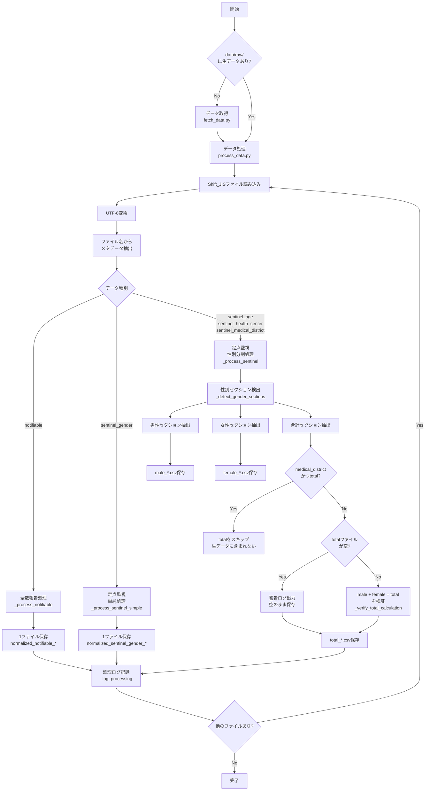
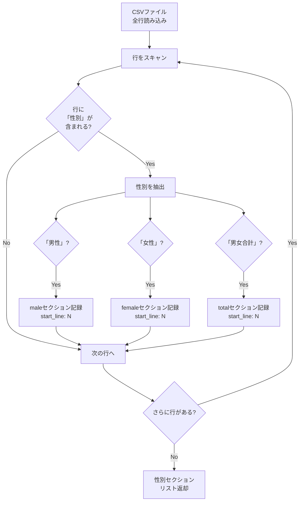
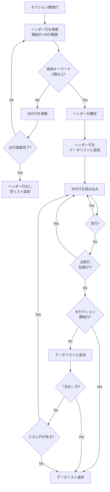
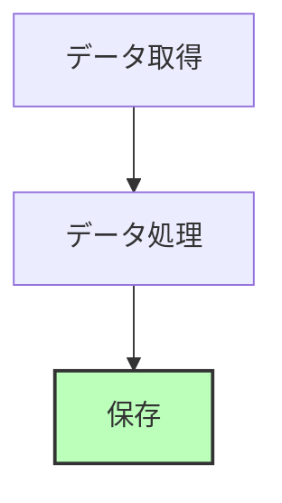

# CLAUDE.md - 東京都感染症発生動向データ自動化プロジェクトガイド

このファイルは、Claude Code(claude.ai/code)が本プロジェクトで効率的に作業するためのガイドラインを提供します。

## 最終更新日

2025-12-23

## バージョン

1.3.0

==============================================================================

## 🚀 プロジェクト構造クイックリファレンス

### 📁 コアファイルの場所

```bash
# プロジェクト仕様
.kiro/specs/tokyo-epidemic-data-automation/
├── requirements.md          # 要求仕様書
├── design.md               # 設計書
└── tasks.md                # タスク一覧

# GitHub Actions ワークフロー
.github/workflows/
├── claude.yml              # Claude AI統合
├── claude-code-review.yml  # コードレビュー自動化
└── fetch-data.yml          # データ取得自動化(作成予定)

# データ保存ディレクトリ
data/
├── raw/                    # 生データ(Shift_JIS、フラット構造)
│   ├── .metadata/          # メタデータファイル保存用
│   │   ├── hash_index.json # ファイルハッシュインデックス
│   │   └── *.json          # 各データファイルのメタデータ
│   └── *.csv               # データファイル(フラット配置)
├── processed/              # 処理済みデータ
└── logs/                   # ログファイル

# ソースコード
src/
├── fetchers/               # データ取得モジュール
│   ├── base_fetcher.py    # 基本フェッチャー
│   └── enhanced_fetcher.py # 拡張フェッチャー
├── managers/               # 管理モジュール
│   ├── config_manager.py   # 設定管理
│   └── storage_manager.py  # ストレージ管理
└── utils/                  # ユーティリティ

# テスト
tests/
├── test_enhanced_fetcher.py
├── test_config_manager.py
└── test_storage_manager.py
```

### 📁 主要スクリプト

```bash
# データ取得
scripts/fetch_data.py       # データ取得メインスクリプト
scripts/check_missing.py    # 欠番チェックユーティリティ

# パッケージ管理
pyproject.toml              # プロジェクト設定とパッケージ定義
uv.lock                     # 依存関係のロックファイル
```

==============================================================================

## 📊 データ処理フロー(Mermaid)

### 全体フロー



### 性別セクション検出の詳細



### データ行抽出の詳細



==============================================================================

## 🔧 ワークフロー別クイックコマンド

### 🔍 ファイル検索

```bash
# プロジェクト仕様の確認(存在しない場合はスキップ)
[ -f .kiro/specs/tokyo-epidemic-data-automation/requirements.md ] && \
  cat .kiro/specs/tokyo-epidemic-data-automation/requirements.md || \
  echo "requirements.md は未作成です"

# GitHub Actionsワークフローの確認
ls -la .github/workflows/

# データディレクトリの確認(存在しない場合はスキップ)
[ -d data ] && ls -la data/ || echo "data/ は未作成です"
```

### ✅ ローカルテスト

```bash
# テストスイートの実行
uv run pytest

# カバレッジレポート付きテスト
uv run pytest --cov=src --cov-report=html

# データ取得のドライラン
uv run python scripts/fetch_data.py --dry-run

# 欠番チェック
uv run python scripts/check_missing.py data/raw

# 全て0データの保存(特殊用途)
# 通常は不要ですが、以下の場合に--save-all-zeroを使用:
# - 未発表データの存在自体を記録したい場合
# - データ収集システムのテスト時
uv run python scripts/fetch_data.py --save-all-zero
```

### 📦 デプロイとスケジューリング

```bash
# GitHub Actionsワークフローの有効化(要: gh CLI インストール & gh auth login)
gh workflow enable fetch-data.yml

# 手動実行
gh workflow run fetch-data.yml

# スケジュール設定(.github/workflows/fetch-data.yml内で設定)
```

==============================================================================

## 📊 プロジェクトの現在のステータス

### 進捗概要(2025-12-23時点)

- **仕様定義**: 完了 ✅
- **GitHub Actions設定**: 完了 ✅(データ取得とテストワークフロー)
- **データ取得モジュール**: 完了 ✅(基本・拡張フェッチャー実装済み)
- **データ処理モジュール**: 完了 ✅(ストレージ管理、設定管理実装済み)
- **自動化ワークフロー**: 完了 ✅(週次自動実行設定済み)
- **テストスイート**: 完了 ✅(50テスト、カバレッジ設定済み)

### システムステータス

- **本番稼働準備完了**
- 初回実行時は2000年からの全データ取得を推奨
- 以降は週次の増分更新で運用

## メタインストラクション:このファイルの使用方法

- **基本原則**: 東京都の感染症データを自動的に取得・管理する堅牢なシステムを構築する
- **私の役割**: プロジェクトオーナー/データアナリスト
- **あなたの役割**: 自動化システムの構築を支援する熟練したアシスタント
- **リロード**: **すべての**アシスタントレスポンスの開始時に、このファイルを再読み込みして準拠を確認してください
- **確認**: 破壊的操作(ファイルの削除、大規模変更、データベース更新など)の前に、「実行してよろしいですか？(y/n)」と確認してください

## 1. プロジェクトコンテキスト

### 1.1 プロジェクト概要

**目的**: 東京都感染症発生動向情報システムからデータを定期的に自動取得し、GitHub上で管理する
**ドメイン**: 公衆衛生データの収集と管理
**主要ユーザー**: データアナリスト、疫学研究者、公衆衛生担当者

### 1.2 技術スタック

| コンポーネント | 説明                             |
| -------------- | -------------------------------- |
| 言語           | Python 3.11+                     |
| 自動化         | GitHub Actions                   |
| データ形式     | CSV(Shift_JIS エンコーディング)  |
| バージョン管理 | Git/GitHub                       |
| エラー通知     | GitHub Issues                    |
| データソース   | 東京都感染症発生動向情報システム |

### 1.3 コア機能

#### データ取得

- TokyoEpidemicSurveillanceFetcherクラスを使用した自動データ取得
- スケジュール実行(毎週)
- エラー時の指数バックオフリトライ(最大3回)

#### データ管理

- 年/月/週の階層ディレクトリ構造
- タイムスタンプ付きファイル命名
- SHA256ハッシュによるデータ整合性検証
- 重複データの検出とスキップ
- **全て0の未発表データの自動スキップ(2025-12-12追加)**
  - 未発表の週や月のデータ(全てのカウントが0)を自動検出
  - 可視化・分析への未発表データ混入を防止(データ品質確保)
  - デフォルト: 全て0のデータはスキップ
  - `--save-all-zero`オプション使用時のみ保存(特殊用途)

#### エラーハンドリング

- 詳細なエラーログ
- GitHub Issues による自動通知
- レート制限の適切な処理
- ネットワークエラーのタイムアウト処理

### 1.4 プロジェクト制約

- **データエンコーディング**: Shift_JISを維持(互換性のため)
- **実行環境**: GitHub Actions (Ubuntu latest)
- **データサイズ**: 大きなCSVファイルの処理に対応
- **プライバシー**: 個人情報を含まない集計データのみ

## 2. パッケージ管理ガイドライン

### 2.1 uvの使用(必須)

このプロジェクトでは、Pythonパッケージ管理に**uvを必ず使用**してください。pipやpoetryは使用しません。

#### インストールと基本コマンド

```bash
# uvのインストール(初回のみ)
curl -LsSf https://astral.sh/uv/install.sh | sh

# 依存関係のインストール
uv sync

# 開発用依存関係も含めてインストール
uv sync --all-extras

# パッケージの追加
uv add requests  # 本番用
uv add --dev pytest  # 開発用

# パッケージの削除
uv remove requests

# スクリプトの実行
uv run python scripts/fetch_data.py
uv run pytest

# 仮想環境のアクティベート(通常は不要)
source .venv/bin/activate
```

#### 重要な原則

- **絶対にpip installを直接使わない**
- **pyproject.tomlがマスター定義**
- **uv.lockファイルは必ずコミット**(再現性の保証)
- **GitHub Actionsでもuvを使用**(高速化と再現性)

#### Dependabotによる自動更新

このプロジェクトでは、Dependabotによる依存関係の自動更新を使用しています。**Dependabotは2025年3月13日から`uv`をネイティブサポート**しており、`pyproject.toml`と`uv.lock`の両方を自動的に更新します。

**設定ファイル**:

- `.github/dependabot.yml`: Dependabotの設定(週次更新、バージョニング戦略、グループ化)
  - `package-ecosystem: "uv"` - uvネイティブサポートを使用
  - セキュリティ更新は2025年12月16日から対応

**バージョニング戦略**:

- メジャーバージョンアップは手動レビュー(破壊的変更を防ぐ)
- マイナー・パッチバージョンのみ自動更新
- セキュリティ更新は別途Dependabot Security Updatesで自動作成

**依存関係のグループ化**:

- `production`: 本番依存関係 (requests, PyYAML)
- `testing`: テスト関連 (pytest\*, pytest-cov)
- `build-tools`: リンター・フォーマッター (ruff, black, isort, mypy, pre-commit)
- `type-stubs`: 型定義ファイル (types-\*)

### 2.2 依存関係の管理

```toml
# pyproject.toml での依存関係定義
[project]
dependencies = [
    "requests>=2.31.0",  # 本番用依存関係
    "PyYAML>=6.0.1",
]

[project.optional-dependencies]
dev = [
    "pytest>=7.4.0",  # 開発用依存関係
    "pytest-cov>=4.1.0",
]
```

## 3. テスト方針

### 3.1 t-wadaアプローチの採用

このプロジェクトでは、和田卓人(t-wada)氏が提唱するテスト駆動開発(TDD)の原則を採用します。

#### 基本原則

1. **テストファーストではなくテストと共に**

   - 実装とテストを交互に書く
   - Red → Green → Refactor のサイクル

2. **AAA(Arrange-Act-Assert)パターン**

   ```python
   def test_fetch_with_retry_success(self):
       # Arrange: 準備
       mock_response = Mock()
       mock_response.status_code = 200

       # Act: 実行
       result = self.fetcher.fetch_with_retry(...)

       # Assert: 検証
       self.assertTrue(result.success)
   ```

3. **テストの独立性**

   - 各テストは独立して実行可能
   - テスト間の依存関係を排除
   - setUp/tearDownで状態を管理

4. **テスト名の命名規則**

   **このプロジェクトでは英語のスネークケース命名規則を使用します。**

   ```python
   # ✅ 正しい例(英語スネークケース)
   def test_duplicate_data_is_not_saved(self):
   def test_retry_three_times_on_error(self):
   def test_wait_when_rate_limit_reached(self):

   # ❌ このプロジェクトでは使用しない(日本語命名)
   # def test_重複データは保存されない(self):
   # def test_エラー時は最大3回リトライする(self):
   ```

   理由:

   - プロジェクト全体で一貫した英語のスネークケースを使用
   - Python標準のPEP 8スタイルガイドに準拠
   - CI/CDツールやIDEとの互換性を保証

### 3.2 テストの実行方法

```bash
# 全テスト実行
uv run pytest

# カバレッジ付き実行
uv run pytest --cov=src --cov-report=html

# 特定のテストのみ実行
uv run pytest tests/test_enhanced_fetcher.py

# 詳細出力
uv run pytest -vv

# 並列実行(高速化)
uv run pytest -n auto
```

### 3.3 モックとテストダブル

```python
# 外部APIはモック化
@patch('requests.Session.post')
def test_api_call(self, mock_post):
    mock_post.return_value.status_code = 200

# 時間依存のテストは時刻を固定
@patch('time.time', return_value=1234567890)
def test_timestamp(self, mock_time):
    pass
```

### 3.4 テストカバレッジ要件(重要)

**カバレッジ不足は深刻な問題です。本質的なテストを追加してカバレッジを維持する必要があります。**

#### カバレッジ目標

- **全体カバレッジ**: 最低80%、理想は85%以上
- **コアモジュール**: 90%以上を目指す
  - `src/fetchers/`: HTTPエラー処理、リトライロジック
  - `src/managers/`: データ保存、設定管理
  - `src/processors/`: データ変換、検証

#### カバレッジ確認方法

```bash
# カバレッジレポート生成
uv run pytest --cov=src --cov-report=term-missing --cov-report=html

# HTMLレポート確認(詳細な未カバー行を表示)
open htmlcov/index.html
```

#### 本質的なテストの原則

1. **修正した全コードパスをテストする**

   - 新機能追加時: 正常系と異常系の両方をテスト
   - バグ修正時: バグが再発しないことを保証するテストを追加
   - リファクタリング時: 既存の動作が変わっていないことを確認

2. **エラーハンドリングは必ずテストする**

   ```python
   # 良い例: HTTPエラーのテスト
   def test_http_403_error_triggers_retry(self):
       """403エラー時にリトライが実行されることを確認"""
       # HTTPエラーをシミュレート
       # リトライロジックが正しく動作することを検証

   def test_http_403_error_uses_double_delay(self):
       """403エラー時に2倍の待機時間を使用することを確認"""
       # 待機時間が通常の2倍になることを検証
   ```

3. **境界値テストを実施する**

   - 最大リトライ回数到達時の動作
   - 空データ、不正なデータの処理
   - タイムアウト、接続エラー

4. **重要な修正は複数の観点でテストする**
   ```python
   # 例: 403エラー対応の場合
   # 1. base_fetcherがHTTPErrorを投げるか
   # 2. RetryHandlerが403をキャッチするか
   # 3. 2倍の待機時間でリトライするか
   # 4. 最大リトライ回数を超えたら失敗するか
   ```

#### カバレッジが低下した場合の対応

1. **未カバーコードを特定**

   ```bash
   uv run pytest --cov=src --cov-report=term-missing | grep "Missing"
   ```

2. **優先度の高い順にテストを追加**

   - 🔴 緊急: エラーハンドリング、セキュリティ関連
   - 🟡 重要: データ処理ロジック、API呼び出し
   - 🟢 通常: ユーティリティ関数、ログ出力

3. **テスト追加後は必ず確認**
   ```bash
   # カバレッジが向上していることを確認
   uv run pytest --cov=src --cov-report=term
   ```

#### 禁止事項

❌ カバレッジのためだけに意味のないテストを書く
❌ テストを削除してカバレッジ計算から除外する
❌ カバレッジレポートを無視する
❌ 「後でテストを書く」と言って放置する

✅ 実際のバグやエッジケースに基づいたテストを書く
✅ コードレビュー時にカバレッジを確認する
✅ 新機能追加時は同時にテストも追加する

#### テスト追加のチェックリスト

新機能やバグ修正時は、以下を確認:

- [ ] 正常系のテストを追加した
- [ ] 異常系(エラー)のテストを追加した
- [ ] 境界値のテストを追加した
- [ ] カバレッジレポートで未カバー行がないか確認した
- [ ] カバレッジが目標値(80%以上)を維持している

## 4. 開発ワークフロー

### 4.1 実装アプローチ

#### フェーズ1: 基本実装

```python
# TokyoEpidemicSurveillanceFetcherクラスの実装
# データ取得の基本機能
# CSVファイルの保存
```

#### フェーズ2: エラーハンドリング

```python
# リトライロジックの実装
# エラーログの記録
# 通知システムの設定
```

#### フェーズ3: 自動化

```yaml
# GitHub Actionsワークフローの作成
# スケジュール設定
# 自動コミットとプッシュ
```

#### フェーズ4: 監視と改善

```python
# データ品質チェック
# パフォーマンス最適化
# ドキュメント作成
```

### 4.2 開発チェックリスト

- [x] TokyoEpidemicSurveillanceFetcherクラスの実装
- [x] エラーハンドリングとリトライロジック
- [x] データ保存とファイル管理
- [x] メタデータとログ記録
- [x] GitHub Actionsワークフローの作成
- [x] 通知システムの設定
- [x] テストとバリデーション
- [x] ドキュメント作成

### 4.3 新機能追加時のチェックリスト

- [ ] pyproject.tomlに依存関係を追加(uvを使用)
- [ ] テストを先に書く(TDDアプローチ)
- [ ] AAA パターンでテストを構造化
- [ ] モックを使用して外部依存を排除
- [ ] カバレッジ80%以上を維持
- [ ] GitHub Actionsでテスト自動実行を確認

### 4.4 PR作成とブランチ管理

#### PR自動作成スクリプト

GitHub Actionsワークフローは `scripts/create_pr.sh` を使用してPRを自動作成します。

**スクリプトの動作**:

1. 新規ブランチを作成してチェックアウト
2. 変更をコミット
3. リモートにプッシュ
4. PRを作成(ラベル付与)
5. **自動マージを設定(squashマージ、マージ後ブランチ自動削除)**
   - auto-merge有効化により、CI/CD成功後に自動的にマージ
   - **マージ完了後、ブランチは自動的に削除される**
   - ブランチ保護ルールの要件を満たす必要がある

**ブランチ命名規則**:

```bash
# 日次データ更新
data-update-daily-{TIMESTAMP}-{RUN_ID}

# 週次データ更新
data-update-weekly-{TIMESTAMP}-{RUN_ID}

# データ処理
data-process-{TIMESTAMP}-{RUN_ID}

# メタデータマイグレーション
metadata-migration-{TIMESTAMP}-{RUN_ID}
```

**ブランチ管理のベストプラクティス**:

- ✅ マージ済みブランチは自動的に削除される(2025-12-23以降)
- ✅ 定期的に不要なブランチがないか確認(通常は不要)
- ✅ ブランチ保護ルールを適切に設定(mainブランチへの直接プッシュを禁止)

## 5. コーディング規約

### 5.1 Pythonコード規約

- **スタイルガイド**: PEP 8準拠
- **型ヒント**: Python 3.11+の型アノテーションを使用
- **エラーハンドリング**: 明示的なtry-exceptブロック
- **ログ**: 構造化ログの使用
- **括弧・記号**: **半角括弧 `()` を使用** (自動修正あり)
  - 全角括弧 `()`、全角コロン `:`、全角チルダ `~` は使用禁止
  - **自動修正**: `fix-fullwidth-symbols` pre-commitフックが全角記号を半角に自動変換
  - Ruff RUF002/RUF003で検出・確認
  - 例: `# データを処理 (オプション)` ✅ / `# データを処理(オプション)` ❌ (自動修正される)

### 5.2 データ可視化ガイドライン

#### グラフの連続性原則 (重要)

**時系列グラフでは0の値を除外してはいけません。**

- **理由**: 0の値を除外すると折れ線グラフに欠損が生じ、視覚的な連続性が損なわれる
- **適用箇所**: `scripts/generate_charts.py`の全データパーサー関数
  - `parse_sentinel_weekly_gender()`: ✅ 0を含める (正しい実装)
  - `parse_notifiable_weekly()`: ✅ 0を含める (修正済み)
  - `parse_sentinel_monthly_gender()`: ✅ 0を含める (正しい実装)

**コード例**:

```python
# ❌ 間違った実装 (0を除外)
if count > 0:
    disease_data[disease_name] = count

# ✅ 正しい実装 (0も含める)
# 注: 0のデータも含める (時系列グラフの連続性を保つため)
disease_data[disease_name] = count
```

**確認方法**:

```bash
# グラフを生成して視覚的に確認
uv run python scripts/generate_charts.py

# 生成されたグラフを確認
open docs/images/notifiable_weekly_absolute.png
```

### 5.3 ファイル命名規則

```python
# データファイル(新形式:タイムスタンプなし、ゼロパディングあり)
# 週次データ
f"{data_type}_weekly_{year}_{week:02d}.csv"
# 例: sentinel_weekly_gender_2025_01.csv, notifiable_weekly_2025_01.csv

# 月次データ
f"{data_type}_monthly_{year}_{month:02d}.csv"
# 例: sentinel_monthly_age_2025_01.csv

# メタデータ(.metadataディレクトリに保存)
f"{data_type}_{period_type}_{year}_{period:02d}.json"

# ログファイル
f"fetch_log_{date}.txt"
```

### 5.4 ディレクトリ構造

```bash
# フラット構造(新形式)
data/
├── raw/
│   ├── .metadata/                          # メタデータ専用ディレクトリ
│   │   ├── hash_index.json                 # 重複チェック用ハッシュインデックス
│   │   ├── sentinel_weekly_age_2025_01.json
│   │   └── notifiable_weekly_2025_52.json
│   ├── sentinel_weekly_gender_2025_01.csv  # 第1週のセンチネル性別データ
│   ├── sentinel_weekly_age_2025_01.csv
│   ├── notifiable_weekly_2025_01.csv       # 第1週の届出疾患データ
│   └── sentinel_monthly_age_2025_12.csv    # 12月の月次データ
├── processed/
└── logs/
```

### 5.5 Mermaidによるフロー図の作成規約(必須)

**基本原則**: MDファイル内でフロー、シーケンス、状態遷移などを記述する場合は、**必ずMermaid記法を使用すること**。

#### 必須事項

1. **ASCIIアート図の禁止**

   - `┌─┐`, `│ │`, `└─┘`, `→`, `▼` などのASCIIアート図は使用しない
   - 既存のASCIIアート図を発見した場合は、Mermaidに変換する

2. **Mermaidの使用が必須な場面**

   - データフロー(システム全体の流れ)
   - プロセスフロー(処理の手順)
   - 状態遷移図
   - シーケンス図(処理の時系列)
   - ER図(データモデル)

3. **推奨するMermaid記法**

```markdown
# フローチャート(最も一般的)

\`\`\`mermaid
flowchart TD
Start[開始] --> Process[処理]
Process --> End[終了]
\`\`\`

# シーケンス図(処理の時系列)

\`\`\`mermaid
sequenceDiagram
User->>System: リクエスト
System->>Database: クエリ
Database-->>System: 結果
System-->>User: レスポンス
\`\`\`

# 状態遷移図

\`\`\`mermaid
stateDiagram-v2
[*] --> Idle
Idle --> Processing: start
Processing --> Complete: success
Processing --> Error: failure
Complete --> [*]
Error --> [*]
\`\`\`
```

4. **スタイリングの推奨**

   - 重要なノードには色付けを行う
   - `style NodeName fill:#f9f,stroke:#333,stroke-width:2px`
   - データ保存場所: `#f9f` (ピンク)
   - 処理中: `#bbf` (青)
   - 完了: `#bfb` (緑)

5. **アクセシビリティ**
   - ノード名は日本語でOK(可読性優先)
   - 改行は `<br/>` を使用

#### 悪い例(ASCIIアート)❌

```
┌─────────────┐
│ データ取得  │
└──────┬──────┘
       │
       ▼
┌─────────────┐
│ データ処理  │
└──────┬──────┘
```

#### 良い例(Mermaid)✅



#### 実装ガイドライン

- **新規作成時**: 必ずMermaidを使用
- **既存ドキュメント修正時**: ASCIIアートを見つけたらMermaidに変換
- **レビュー時**: ASCIIアートがあればMermaidへの変換を指摘
- **参照**: [Mermaid公式ドキュメント](https://mermaid.js.org/)

#### 例外規定: ディレクトリ構造の表記

##### ディレクトリ構造はMermaid禁止、tree形式を使用すること

ディレクトリ構造やファイルツリーを表記する場合は、Mermaidではなく**tree形式のテキスト表記**を使用してください。

##### 理由

- ディレクトリ構造はtree形式が最も可読性が高い
- Mermaidでディレクトリ構造を表現すると冗長で見づらくなる
- 標準的なUNIX treeコマンドの出力形式との一貫性を保つ

##### 推奨フォーマット

```markdown
\`\`\`text
data/
├── raw/ # 生データ
│ ├── .metadata/ # メタデータ
│ │ └── hash*index.json
│ └── *.csv
└── processed/ # 処理済みデータ
├── .metadata/
└── \_.csv
\`\`\`
```

##### 禁止事項

- ❌ ディレクトリ構造をMermaid flowchartで表現しない
- ❌ ディレクトリ構造をMermaid graphで表現しない

##### 適用範囲

- この例外はディレクトリ構造とファイルツリーの表記のみに適用
- データフロー、プロセスフロー、状態遷移などは引き続きMermaidを使用

### 5.6 ディレクトリ構造(tree形式)のコメント位置統一規約

**基本原則**: tree形式でディレクトリ構造を記述する際、インラインコメント(`#`)の位置は**必ず統一すること**。

#### コメント位置統一の重要性

- **視覚的な統一性**: コメント位置が揃っていることで、ドキュメントの可読性が向上
- **保守性の向上**: 統一された形式により、後からの編集が容易
- **プロフェッショナリズム**: 技術文書としての品質を保証

#### 実装ガイドライン

1. **コメント開始位置の決定**

   - 最も長いパス名(ディレクトリ名+ファイル名)を基準に、コメント記号 `#` の開始位置を決定
   - 推奨: パス名の末尾から2スペース空けた位置(または統一したカラム位置)

2. **全行で統一**

   - トップレベルディレクトリ(`├── raw/`、`└── logs/` など)も含めて、**全ての行**でコメント位置を揃える
   - 一部の行だけ揃えると、かえって見づらくなる

3. **スペースで位置調整**

   - パス名が短い行は、スペースを追加してコメント位置を揃える
   - タブ文字は使用しない(環境により表示が異なるため)

#### 良い例 ✅

```text
data/
├── raw/                                                      # 生データ (Shift_JIS エンコーディング)
│   ├── .metadata/                                            # メタデータファイル保存用
│   │   ├── hash_index.json                                   # 重複チェック用ハッシュインデックス
│   │   └── *.json                                            # 各データファイルのメタデータ
│   ├── sentinel_weekly_gender_2025_01.csv                    # 2025年第1週の性別データ
│   └── notifiable_weekly_2025_01.csv                         # 2025年第1週の全数把握データ
├── processed/                                                # 処理済みデータ (UTF-8、性別分割済み)
│   └── normalized_*.csv                                      # 正規化済みデータ
└── logs/                                                     # ログファイル
```

**ポイント**: 全ての `#` が63カラム目に統一されている

#### 悪い例 ❌

```markdown
\`\`\`text
data/
├── raw/ # 生データ (Shift*JIS エンコーディング)
│ ├── .metadata/ # メタデータファイル保存用
│ │ ├── hash_index.json # 重複チェック用ハッシュインデックス
│ │ └── \*.json # 各データファイルのメタデータ
│ ├── sentinel_weekly_gender_2025_01.csv # 2025年第1週の性別データ
│ └── notifiable_weekly_2025_01.csv # 2025年第1週の全数把握データ
├── processed/ # 処理済みデータ
│ └── normalized*\*.csv # 正規化済みデータ
└── logs/ # ログファイル
\`\`\`
```

**問題点**:

- `raw/`、`processed/`、`logs/` のコメント位置がずれている
- 視覚的な統一性が欠如している

#### 実装手順

1. **最長パスの特定**: tree構造内で最も長いパス名を見つける
2. **コメント位置の決定**: 最長パス + 2スペース の位置に `#` を配置
3. **全行に適用**: 全ての行で同じカラム位置にスペースで調整
4. **目視確認**: コミット前に必ず全ての `#` が縦に揃っているか確認

#### チェックポイント

- [ ] 全ての `#` コメント記号が同じカラム位置に揃っている
- [ ] トップレベルディレクトリ(`├──`、`└──`)のコメントも統一位置
- [ ] スペースのみで位置調整(タブ文字なし)
- [ ] コードブロック(\`\`\`text)で囲まれている

#### 自動検証・修正(pre-commitフック)

**重要**: このプロジェクトでは、以下のpre-commitフックが設定されています。

##### 1. 全角記号の自動修正 `fix-fullwidth-symbols`

**動作**:

- PythonファイルとMarkdownファイルのコミット時に自動実行
- 全角括弧 `()` → 半角括弧 `()`
- 全角コロン `:` → 半角コロン `:`
- 全角チルダ `~` → 半角チルダ `~`
- 検出された全角記号を**自動的に半角に変換**

**手動実行**:

```bash
# 全ファイルを修正
uv run pre-commit run fix-fullwidth-symbols --all-files

# 特定のファイルを修正
python3 scripts/fix_fullwidth_symbols.py src/file.py README.md
```

**例**:

```python
# コミット前
def test():  # テスト関数(全角括弧)
    pass

# 自動修正後
def test():  # テスト関数 (半角括弧)
    pass
```

##### 2. tree形式コメント位置統一チェック `check-tree-comment-alignment`

**動作**:

- Markdownファイル(`.md`)のコミット時に自動実行
- `\`\`\`text` ブロック内のtree構造を検出
- 全ての `#` コメント記号の位置を解析
- 位置が統一されていない場合、詳細なエラーメッセージを表示してコミットを中断

**手動実行**:

```bash
# 全Markdownファイルをチェック
uv run pre-commit run check-tree-comment-alignment --all-files

# 特定のファイルをチェック
python3 scripts/check_tree_comment_alignment.py README.md CLAUDE.md
```

**エラー例**:

```text
README.md: コメント位置が統一されていません
  検出された位置: [47, 74] カラム
  詳細:

  47カラム目 (2行):
    L278: ├── raw/                                                             # 生データ
    L286: ├── processed/                                                       # 処理済みデータ

  74カラム目 (1行):
    L279: │   ├── .metadata/                                                   # メタデータ
    ...
```

**修正方法**:

1. エラーメッセージで報告された行番号を確認
2. 最も長いパス名を基準に、全ての `#` を同じカラム位置に揃える
3. スペースで位置調整
4. 再度コミットを試行

#### 参考情報

一般的なMarkdown文書化のベストプラクティスに基づく推奨事項:

- [How to display Directory & File structure in Markdown Files](https://bobbyhadz.com/blog/markdown-display-directory-and-file-structure)
- [represent a directory tree structure in markdown](https://gist.github.com/genadyp/ffc112df6c8b368127e3cbb37465d452)
- [Code Documentation Best Practices](https://onenine.com/code-documentation-best-practices/)

## 6. デバッグとトラブルシューティング

### 6.1 一般的なエラー

| エラー          | 原因                            | 解決策                     |
| --------------- | ------------------------------- | -------------------------- |
| ConnectionError | ネットワーク接続の問題          | リトライロジックの確認     |
| EncodingError   | Shift_JISエンコーディングの問題 | エンコーディング指定の確認 |
| RateLimitError  | APIレート制限                   | 遅延の追加                 |
| DuplicateError  | 重複データ                      | ハッシュチェックの確認     |

### 6.2 検証スクリプト

```bash
# テスト実行
uv run pytest -vv

# 特定のテストをデバッグ
uv run pytest tests/test_enhanced_fetcher.py::TestEnhancedEpidemicDataFetcher::test_fetch_with_retry_success -vv

# ログ確認
tail -f data/logs/fetch_log_$(date +%Y%m%d).txt
```

## 7. GitHub Actions設定

### 7.1 ワークフローテンプレート

```yaml
name: Fetch Tokyo Epidemic Data
on:
  schedule:
    - cron: "0 10 * * 1" # 毎週月曜日 19:00 JST
  workflow_dispatch: # 手動実行も可能

permissions:
  contents: write
  actions: read

concurrency:
  group: fetch-data
  cancel-in-progress: true

jobs:
  fetch-data:
    runs-on: ubuntu-latest
    steps:
      - uses: actions/checkout@v4
      - uses: astral-sh/setup-uv@v4
        with:
          enable-cache: true
          cache-dependency-glob: "uv.lock"
      - run: uv python install 3.11
      - run: uv sync
      - run: uv run python scripts/fetch_data.py
      - name: Configure git
        run: |
          git config user.name "github-actions[bot]"
          git config user.email "github-actions[bot]@users.noreply.github.com"
      - name: Commit and push if changed
        run: |
          git add data/
          if ! git diff --staged --quiet; then
            git commit -m "データ更新: $(date +'%Y-%m-%d %H:%M')"
            git push
          else
            echo "No changes to commit."
          fi
```

### 7.2 環境変数とシークレット

```bash
# リポジトリシークレットの設定(必要に応じて)
GITHUB_TOKEN        # 自動コミット用
NOTIFICATION_WEBHOOK # 通知用(オプション)

# 注意: シークレットはログに出力されないよう、GitHub Actionsの::add-mask::を使用してマスクしてください
```

## 8. プロジェクト固有のパターン

### 8.1 データ取得パターン

```python
# 基本的な取得パターン(タイムアウトとジッター付き)
async def fetch_with_retry(url, max_retries=3):
    import random
    for attempt in range(max_retries):
        try:
            # fetchはタイムアウト引数に対応している想定
            response = await fetch(url, timeout=10)
            return response
        except (TimeoutError, FetchError) as e:  # 実際の例外クラスに置き換える
            if attempt == max_retries - 1:
                raise
            # ジッター付き指数バックオフ
            wait = (2 ** attempt) + random.uniform(0, 0.5)
            await asyncio.sleep(wait)
    raise MaxRetriesExceeded()
```

### 8.2 データ検証パターン

```python
# CSVデータの検証
def validate_csv(file_path):
    # エンコーディングチェック
    # カラム数チェック
    # データ型チェック
    # 日付範囲チェック
    pass

# 全て0のデータチェック(2025-12-12追加)
def is_all_zero_data(data: bytes) -> bool:
    """未発表データ(全て0)を検出

    未発表の週や月のデータは全てのカウントが0になっているため、
    これらを自動的にスキップして可視化・分析への混入を防ぐ。

    実装箇所: src/managers/storage_manager.py::_is_all_zero_data()
    """
    # Shift_JISデコード
    # ヘッダー行・注釈行を無視
    # 数値カラムが全て0かチェック
    pass
```

### 8.3 メタデータスキーマ (v1.3.0)

#### メタデータの2つの検証フィールド

メタデータには**2種類の検証フィールド**があり、異なる目的で使用されます:

| フィールド            | 用途                 | 例                                          |
| --------------------- | -------------------- | ------------------------------------------- |
| **verification**      | ファイル形式の検証   | CSVカラム数の不整合                         |
| **quality** (v1.2.0+) | データ内容の品質検証 | 性別合計値の不整合 (male + female != total) |

#### verification フィールド (ファイル形式検証)

ファイル自体の**構造的な問題**を記録します。

**構造**:

```python
"verification": {
    "status": "verified",  # "verified" | "failed" | "pending"
    "verified_at": "2025-12-23T00:00:00Z",
    "method": "automated",
    "checks": {
        "file_size": True,
        "encoding": True,
        "csv_format": True,
        "path_safety": True
    },
    "errors": [],  # 検証エラーリスト
    "warnings": [   # 警告リスト(v1.3.0で統一形式化)
        "[csv_format] Inconsistent column count"
    ],
    "details": {  # v1.3.0: 構造化詳細情報
        "column_counts": [0, 1, 2, 10]  # 観測されたカラム数のリスト
    }
}
```

**v1.3.0の変更点**:

- **警告メッセージの統一**: `[csv_format] Inconsistent column count: {0, 1, 2, 10}` → `[csv_format] Inconsistent column count`
- **詳細情報の構造化**: 具体的な値(カラム数)は `details.column_counts` に保存
- **検索性と集計性の向上**: 統一メッセージでグループ化可能

#### quality フィールド (データ品質検証)

データ**内容の品質問題**を記録します。

**構造**:

```python
"quality": {
    "validation_timestamp": "2025-12-20T18:25:51.756524+00:00",
    "validation_status": "completed",  # 全体の検証プロセスのステータス
    "issues": [  # 検証で発見された問題のリスト (空の場合は問題なし)
        {
            "check_type": "gender_sum_consistency",
            "validation_status": "completed",  # この検証のステータス
            "message": "Observed mismatch between (male + female) and reported total in 5 record(s)",
            "details": {
                "source_file": "sentinel_weekly_age_2025_01.csv",
                "affected_count": 5,  # 問題のあるレコード数
                "truncated": False,  # affected_locationsが切り詰められているか
                "affected_locations": [  # 不整合がある場合、詳細リスト (最大10件)
                    {
                        "location": "千代田区",
                        "column": "インフルエンザ",
                        "row_index": 5,
                        "male": 10,
                        "female": 8,
                        "total": 20,  # 元データの値
                        "expected": 18  # male + female の期待値
                    }
                ]
            }
        }
    ]
}
```

**検証内容**:

- `male + female = total` の一致確認 (性別データがあるファイルのみ)
- 不整合がある場合、場所・行・列・期待値を記録 (最大10件、超過時は truncated: true)
- 問題がない場合は `issues: []` (空リスト)
- 実装: `src/validators/quality_validator.py` (orchestrator), `src/validators/gender_sum_validator.py` (個別検証)

#### マイグレーション

メタデータスキーマのバージョンアップ時は、`scripts/migrate_metadata.py` を使用:

```bash
# ドライラン(変更内容を確認)
uv run python scripts/migrate_metadata.py --dry-run

# 実際にマイグレーション実行
uv run python scripts/migrate_metadata.py

# 特定バージョンへ
uv run python scripts/migrate_metadata.py --target-version 1.3.0
```

**バージョン履歴**:

- **v1.0**: 基本スキーマ
- **v1.1.0**: temporal フィールド追加
- **v1.2.0**: quality フィールド追加(性別合計検証)
- **v1.3.0**: verification.details フィールド追加(警告詳細の構造化)

## 9. 重要な注意事項

- **必ず** データ取得前に既存データをチェックして重複を避ける
- **決して** 個人情報を含むデータを保存しない
- **常に** Shift_JISエンコーディングを維持する
- **定期的に** 古いデータのアーカイブを検討する
- **エラー時は** 必ずログを記録し、必要に応じて通知する
- **全て0のデータは自動的にスキップされる**(2025-12-12以降)
  - 未発表の週や月のデータは保存されない
  - `--save-all-zero`オプションで明示的に指定した場合のみ保存される

## 10. プロジェクト運用ガイドライン

### 10.1 日次チェック項目

- [ ] GitHub Actionsの実行状況確認
- [ ] エラーログの確認
- [ ] データ整合性チェック

### 10.2 週次メンテナンス

- [ ] データバックアップの確認
- [ ] ストレージ使用量の確認
- [ ] パフォーマンスメトリクスのレビュー
- [ ] テストカバレッジの確認

### 10.3 月次レビュー

- [ ] データ品質レポートの生成
- [ ] システム改善点の検討
- [ ] ドキュメントの更新

## 11. リファレンス

### 11.1 関連ドキュメント

- [東京都感染症発生動向情報システム](https://survey.tmiph.metro.tokyo.lg.jp/)
- [GitHub Actions ドキュメント](https://docs.github.com/ja/actions)
- [Python asyncio ドキュメント](https://docs.python.org/ja/3/library/asyncio.html)

- [uv ドキュメント](https://github.com/astral-sh/uv)
- [pytest ドキュメント](https://docs.pytest.org/)

### 11.2 プロジェクトファイル

- `.kiro/specs/tokyo-epidemic-data-automation/requirements.md` - 要求仕様
- `.kiro/specs/tokyo-epidemic-data-automation/design.md` - 設計書
- `.kiro/specs/tokyo-epidemic-data-automation/tasks.md` - タスク一覧

- `pyproject.toml` - パッケージ定義と設定
- `config/config.yml` - アプリケーション設定

## 12. トラブルシューティングFAQ

**Q: データ取得が失敗する**
A: ネットワーク接続、URLの変更、レート制限を確認してください。

**Q: 文字化けが発生する**
A: Shift_JISエンコーディングが正しく設定されているか確認してください。

**Q: GitHub Actionsが動作しない**
A: ワークフローの権限設定とシークレットの設定を確認してください。

**Q: テストが失敗する**
A: `uv sync --all-extras`で開発用依存関係をインストールしてから`uv run pytest`を実行してください。

**Q: uvコマンドが見つからない**
A: `curl -LsSf https://astral.sh/uv/install.sh | sh`でuvをインストールしてください。

---

# 重要な指示の再確認

求められたことだけを実行し、それ以上もそれ以下もしない。
目的達成に絶対に必要でない限り、ファイルを作成しない。
既存ファイルの編集を新規作成より常に優先する。
ユーザーから明示的に要求されない限り、ドキュメントファイル(\*.md)やREADMEファイルを積極的に作成しない。
