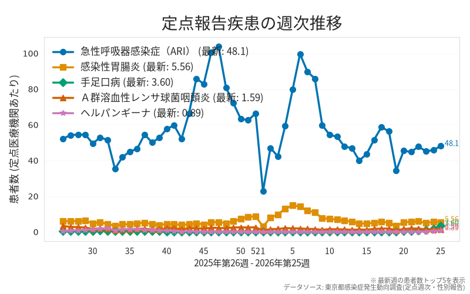
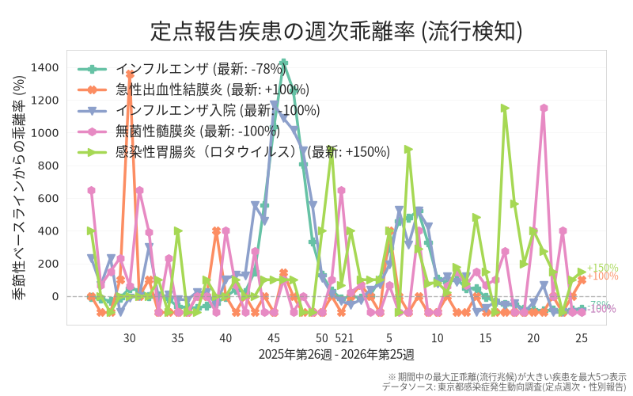
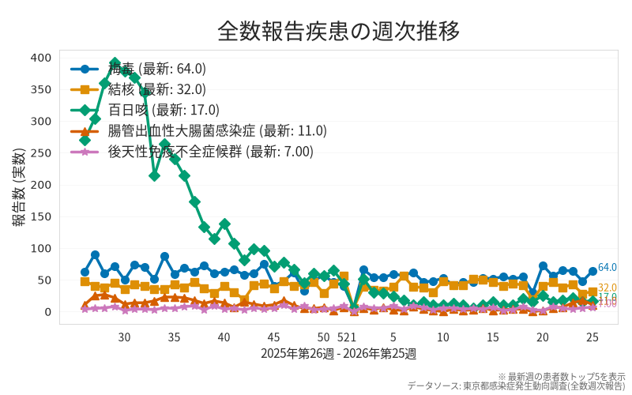
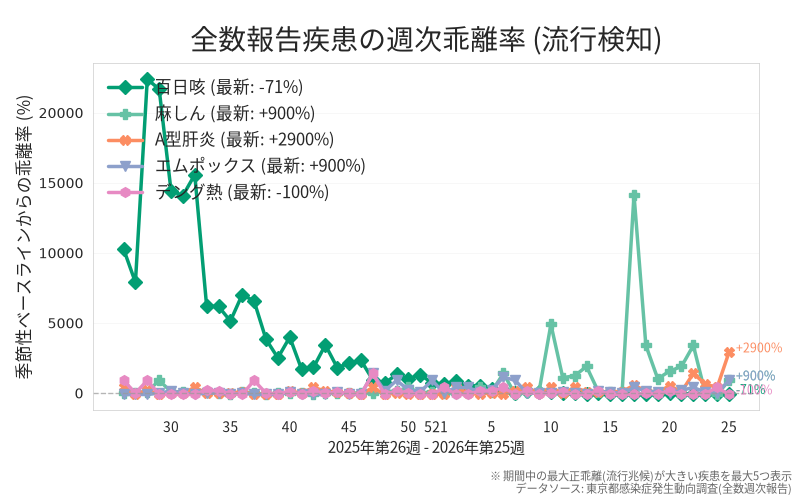
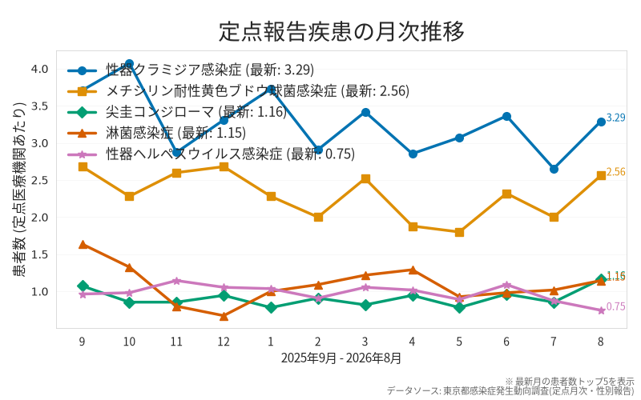
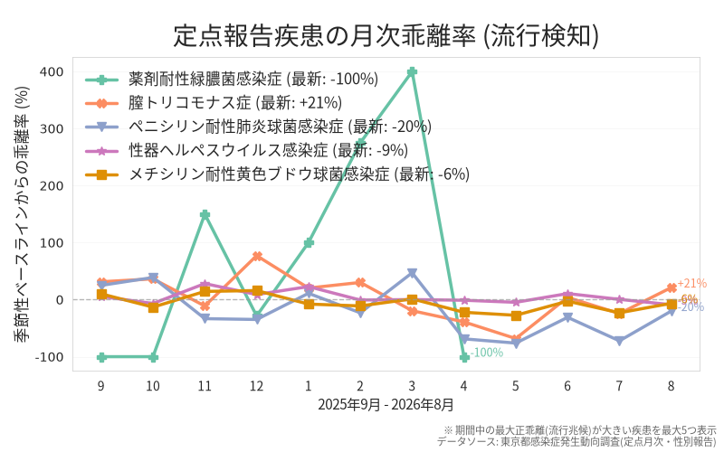
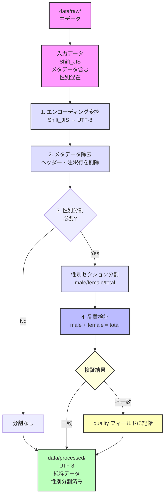

# 東京都感染症発生動向データ自動収集システム

[](https://github.com/kambarakun/fetch-tokyo-idsc-github-actions/actions/workflows/fetch-data.yml)
[](https://github.com/kambarakun/fetch-tokyo-idsc-github-actions/actions/workflows/fetch-data-daily.yml)
[](https://github.com/kambarakun/fetch-tokyo-idsc-github-actions/actions/workflows/fetch-data-weekly.yml)
[](https://github.com/kambarakun/fetch-tokyo-idsc-github-actions/actions/workflows/test.yml)
[](https://codecov.io/gh/kambarakun/fetch-tokyo-idsc-github-actions)
[](LICENSE.md)

東京都感染症発生動向情報システムから定期的にデータを自動取得・保存するGitHub Actionsベースのシステムです。

<!-- start data-statistics -->
<!-- prettier-ignore-start -->
## 📊 データ収集状況 (自動更新)

> 💡 このセクションは `scripts/update_readme_stats.py` により自動生成されています。

### 📅 最新データ

| 項目 | 値 |
|------|-----|
| **最新週次データ** | 2026年第25週 |
| **最新月次データ** | 2026年5月 |
| **最新データ取得日時** | 2026-06-25 18:13 JST |
| **最終データ更新日時** | 2026-06-25 18:13 JST |

> 📝 **日時の説明**
> - **最新データ取得日時**: データ取得処理が最後に実行された日時 (毎日自動実行)
> - **最終データ更新日時**: 東京都IDSCから実際にデータを取得できた日時

### 📊 感染動向の可視化

> 💡 季節性ベースライン (同週/同月の過去5年平均) からの乖離率で流行を検知

#### 週次定点 (Sentinel Surveillance - Weekly)

<table>
  <tr>
    <td width="50%">
      
      <p align="center"><sub>定点週次・絶対数 (直近52週・1年間)</sub></p>
    </td>
    <td width="50%">
      
      <p align="center"><sub>定点週次・季節性乖離率 (%)</sub></p>
    </td>
  </tr>
</table>

#### 週次全数 (Notifiable Diseases - Weekly)

<table>
  <tr>
    <td width="50%">
      
      <p align="center"><sub>全数報告週次・絶対数 (直近52週・1年間)</sub></p>
    </td>
    <td width="50%">
      
      <p align="center"><sub>全数報告週次・季節性乖離率 (%)</sub></p>
    </td>
  </tr>
</table>

#### 月次定点 (Sentinel Surveillance - Monthly)

<table>
  <tr>
    <td width="50%">
      
      <p align="center"><sub>定点月次・絶対数 (直近12ヶ月)</sub></p>
    </td>
    <td width="50%">
      
      <p align="center"><sub>定点月次・季節性乖離率 (%)</sub></p>
    </td>
  </tr>
</table>

### 📈 収集統計

| 項目 | 値 |
|------|-----|
| **総データ件数** | 8,144件 |
| **週次データ期間** | 2000年第1週 - 2026年第25週 |
| **月次データ期間** | 2000年1月 - 2026年5月 |
| **収集週数** | 1,381週 |
| **収集月数** | 317ヶ月 |
| **データ種別数** | 9種類 |

### 📋 データ種別内訳

| データ種別 | 件数 | データ期間 | 欠損 |
|-----------|------|-----------|------|
| 定点週次・年齢群 | 1,381件 | 2000年第1週-2026年第25週 | なし |
| 定点週次・保健所別 | 1,381件 | 2000年第1週-2026年第25週 | なし |
| 全数週次 | 1,381件 | 2000年第1週-2026年第25週 | なし |
| 定点週次・医療圏別 | 1,368件 | 2000年第14週-2026年第25週 | なし |
| 定点週次・性別 | 1,368件 | 2000年第14週-2026年第25週 | なし |
| 定点月次・医療圏別 | 317件 | 2000年1月-2026年5月 | なし |
| 定点月次・年齢群 | 317件 | 2000年1月-2026年5月 | なし |
| 定点月次・保健所別 | 317件 | 2000年1月-2026年5月 | なし |
| 定点月次・性別 | 314件 | 2000年4月-2026年5月 | なし |

### 🔍 データ品質チェック

#### 📁 生データ (raw) の検証

##### ⚠️ 警告 (8144件)

> 💡 CSVファイル内で行ごとにカラム数が異なります。東京都IDSCの元データには注釈行や集計期間情報が含まれているため発生します。

<details>
<summary><strong>[csv_format] Inconsistent column count</strong> (8144件)</summary>

```text
notifiable_weekly_2026_25.csv
sentinel_weekly_age_2026_25.csv
sentinel_weekly_gender_2026_25.csv
sentinel_weekly_health_center_2026_25.csv
sentinel_weekly_medical_district_2026_25.csv
notifiable_weekly_2026_24.csv
sentinel_weekly_age_2026_24.csv
sentinel_weekly_gender_2026_24.csv
sentinel_weekly_health_center_2026_24.csv
sentinel_weekly_medical_district_2026_24.csv
notifiable_weekly_2026_23.csv
sentinel_weekly_age_2026_23.csv
sentinel_weekly_gender_2026_23.csv
sentinel_weekly_health_center_2026_23.csv
sentinel_weekly_medical_district_2026_23.csv
notifiable_weekly_2026_22.csv
sentinel_weekly_age_2026_22.csv
sentinel_weekly_gender_2026_22.csv
sentinel_weekly_health_center_2026_22.csv
sentinel_weekly_medical_district_2026_22.csv
notifiable_weekly_2026_21.csv
sentinel_weekly_age_2026_21.csv
sentinel_weekly_gender_2026_21.csv
sentinel_weekly_health_center_2026_21.csv
sentinel_weekly_medical_district_2026_21.csv
notifiable_weekly_2026_20.csv
sentinel_weekly_age_2026_20.csv
sentinel_weekly_gender_2026_20.csv
sentinel_weekly_health_center_2026_20.csv
sentinel_weekly_medical_district_2026_20.csv
notifiable_weekly_2026_19.csv
sentinel_weekly_age_2026_19.csv
sentinel_weekly_gender_2026_19.csv
sentinel_weekly_health_center_2026_19.csv
sentinel_weekly_medical_district_2026_19.csv
notifiable_weekly_2026_18.csv
sentinel_weekly_age_2026_18.csv
sentinel_weekly_gender_2026_18.csv
sentinel_weekly_health_center_2026_18.csv
sentinel_weekly_medical_district_2026_18.csv
notifiable_weekly_2026_17.csv
sentinel_weekly_age_2026_17.csv
sentinel_weekly_gender_2026_17.csv
sentinel_weekly_health_center_2026_17.csv
sentinel_weekly_medical_district_2026_17.csv
notifiable_weekly_2026_16.csv
sentinel_weekly_age_2026_16.csv
sentinel_weekly_gender_2026_16.csv
sentinel_weekly_health_center_2026_16.csv
sentinel_weekly_medical_district_2026_16.csv
... 他8094件
```

</details>


#### 📊 処理済みデータ (processed) の品質チェック

##### 🔍 データ品質の問題 (1016件)

> 🔍 性別データの合計値検証で不整合が検出されました。男性+女性の合計が、元データの男女合計値と一致しません。

<details>
<summary><strong>gender_sum_consistency</strong> (1016ファイル, 不整合: 11736件)</summary>

```text
sentinel_weekly_medical_district_2026_25.csv (不整合: 11件)
sentinel_weekly_medical_district_2026_24.csv (不整合: 13件)
sentinel_weekly_medical_district_2026_23.csv (不整合: 10件)
sentinel_weekly_medical_district_2026_22.csv (不整合: 12件)
sentinel_weekly_medical_district_2026_21.csv (不整合: 11件)
sentinel_weekly_medical_district_2026_20.csv (不整合: 12件)
sentinel_weekly_medical_district_2026_19.csv (不整合: 11件)
sentinel_weekly_medical_district_2026_18.csv (不整合: 10件)
sentinel_weekly_medical_district_2026_17.csv (不整合: 12件)
sentinel_weekly_medical_district_2026_16.csv (不整合: 13件)
sentinel_weekly_medical_district_2026_15.csv (不整合: 13件)
sentinel_weekly_medical_district_2026_14.csv (不整合: 10件)
sentinel_weekly_medical_district_2026_13.csv (不整合: 13件)
sentinel_weekly_medical_district_2026_12.csv (不整合: 11件)
sentinel_weekly_medical_district_2026_11.csv (不整合: 12件)
sentinel_weekly_medical_district_2026_10.csv (不整合: 12件)
sentinel_weekly_medical_district_2026_09.csv (不整合: 13件)
sentinel_weekly_medical_district_2026_08.csv (不整合: 12件)
sentinel_weekly_medical_district_2026_07.csv (不整合: 11件)
sentinel_weekly_medical_district_2026_06.csv (不整合: 13件)
sentinel_weekly_medical_district_2026_05.csv (不整合: 14件)
sentinel_weekly_medical_district_2026_04.csv (不整合: 12件)
sentinel_weekly_medical_district_2026_03.csv (不整合: 14件)
sentinel_weekly_medical_district_2026_02.csv (不整合: 11件)
sentinel_weekly_medical_district_2026_01.csv (不整合: 12件)
sentinel_weekly_medical_district_2025_52.csv (不整合: 13件)
sentinel_weekly_medical_district_2025_51.csv (不整合: 13件)
sentinel_weekly_medical_district_2025_50.csv (不整合: 12件)
sentinel_weekly_medical_district_2025_49.csv (不整合: 12件)
sentinel_weekly_medical_district_2025_48.csv (不整合: 13件)
sentinel_weekly_medical_district_2025_47.csv (不整合: 14件)
sentinel_weekly_medical_district_2025_46.csv (不整合: 13件)
sentinel_weekly_medical_district_2025_45.csv (不整合: 13件)
sentinel_weekly_medical_district_2025_44.csv (不整合: 13件)
sentinel_weekly_medical_district_2025_43.csv (不整合: 11件)
sentinel_weekly_medical_district_2025_42.csv (不整合: 12件)
sentinel_weekly_medical_district_2025_41.csv (不整合: 13件)
sentinel_weekly_medical_district_2025_40.csv (不整合: 10件)
sentinel_weekly_medical_district_2025_39.csv (不整合: 12件)
sentinel_weekly_medical_district_2025_38.csv (不整合: 14件)
sentinel_weekly_medical_district_2025_37.csv (不整合: 13件)
sentinel_weekly_medical_district_2025_36.csv (不整合: 13件)
sentinel_weekly_medical_district_2025_35.csv (不整合: 13件)
sentinel_weekly_medical_district_2025_34.csv (不整合: 12件)
sentinel_weekly_medical_district_2025_33.csv (不整合: 12件)
sentinel_weekly_medical_district_2025_32.csv (不整合: 12件)
sentinel_weekly_medical_district_2025_31.csv (不整合: 13件)
sentinel_weekly_medical_district_2025_30.csv (不整合: 10件)
sentinel_weekly_medical_district_2025_29.csv (不整合: 12件)
sentinel_weekly_medical_district_2025_28.csv (不整合: 12件)
... 他966ファイル
```

</details>


<!-- prettier-ignore-end -->
<!-- end data-statistics -->

## 📋 主な機能

- 🔄 **自動収集**: GitHub Actionsによる2種類の自動実行
  - **📅 毎日データ簡易チェック**: 毎日17:00 JST - 最新週＋前週の週次データ、当月＋前月の月次データを確認・取得
  - **📆 毎週データ徹底チェック**: 毎週木曜17:30 JST - 現在年の全データ(週次・月次)を包括的チェック(1月は前年分も含む)
- 🔍 **重複検出**: SHA256ハッシュによるデータ整合性検証
- 🔁 **リトライ機能**: エラー時の自動リトライ(最大3回)
- 📝 **メタデータ管理**: 各データファイルの収集情報を記録
- 🚨 **エラー通知**: GitHub Issuesによる自動通知
- 📊 **増分更新**: 既存データをスキップして新規データのみ取得
- 🎯 **未発表データ自動除外**: 全て0の未発表データを自動検出してスキップ(可視化・分析の品質確保)
- 🔀 **自動PR作成**: データ更新時に自動でPull Request作成
- ✨ **自動マージ**: データ検証成功時にPRを自動的にマージ

## 📊 データ構造とダウンロード内容

### 📁 データ構造

#### 収集データタイプ(9種類)

本システムは以下の9種類のデータを自動収集します:

| データタイプ                          | 報告形式 | 期間 | 分類             | 説明                                       |
| ------------------------------------- | -------- | ---- | ---------------- | ------------------------------------------ |
| **sentinel_weekly_gender**            | 定点     | 週次 | 性別             | 定点あたり患者報告数(性別)                 |
| **sentinel_weekly_age**               | 定点     | 週次 | 年齢群           | 定点あたり患者報告数(年齢群)               |
| **sentinel_weekly_health_center**     | 定点     | 週次 | 保健所別         | 定点あたり患者報告数(保健所別)             |
| **sentinel_weekly_medical_district**  | 定点     | 週次 | 二次保健医療圏別 | 定点あたり患者報告数(二次保健医療圏別)     |
| **notifiable_weekly**                 | 全数     | 週次 | 全数把握疾患     | 感染症患者報告数(全数把握疾患)             |
| **sentinel_monthly_gender**           | 定点     | 月次 | 性別             | 月別定点あたり患者報告数(性別)             |
| **sentinel_monthly_age**              | 定点     | 月次 | 年齢群           | 月別定点あたり患者報告数(年齢群)           |
| **sentinel_monthly_health_center**    | 定点     | 月次 | 保健所別         | 月別定点あたり患者報告数(保健所別)         |
| **sentinel_monthly_medical_district** | 定点     | 月次 | 二次保健医療圏別 | 月別定点あたり患者報告数(二次保健医療圏別) |

<details>
<summary>📁 ディレクトリ構造 / ファイル命名規則 / メタデータスキーマ v1.3.0 (クリックして展開)</summary>

#### データディレクトリ構造

```text
data/
├── raw/                                                                 # 生データ (Shift_JIS エンコーディング)
│   ├── .metadata/                                                       # メタデータファイル保存用
│   │   ├── hash_index.json                                              # 重複チェック用ハッシュインデックス
│   │   └── *.json                                                       # 各データファイルのメタデータ
│   ├── sentinel_weekly_gender_2025_01.csv                               # 2025年第1週の性別データ
│   ├── sentinel_weekly_age_2025_01.csv                                  # 2025年第1週の年齢群データ
│   ├── notifiable_weekly_2025_01.csv                                    # 2025年第1週の全数把握データ
│   └── sentinel_monthly_age_2025_01.csv                                 # 2025年1月の月次年齢群データ
├── processed/                                                           # 処理済みデータ (UTF-8、性別分割済み)
│   ├── .metadata/                                                       # 処理済みファイルのメタデータ
│   │   └── normalized_*.json                                            # 各ファイルの個別メタデータ
│   ├── normalized_notifiable_weekly_2000_01.csv                         # 全数報告 (UTF-8、メタデータ除去)
│   ├── normalized_sentinel_weekly_age_male_2000_01.csv                  # 定点・年齢群・男性 (UTF-8)
│   ├── normalized_sentinel_weekly_age_female_2000_01.csv                # 定点・年齢群・女性 (UTF-8)
│   ├── normalized_sentinel_weekly_age_total_2000_01.csv                 # 定点・年齢群・合計 (UTF-8、元データの値を検証済み)
│   ├── normalized_sentinel_weekly_medical_district_male_2000_01.csv     # 定点・医療圏・男性 (UTF-8)
│   ├── normalized_sentinel_weekly_medical_district_female_2000_01.csv   # 定点・医療圏・女性 (UTF-8)
│   └── normalized_sentinel_weekly_gender_2000_01.csv                    # 定点・性別 (UTF-8、性別列形式のため分割なし)
└── logs/                                                                # ログファイル
```

#### ファイル命名規則

**生データ(data/raw/):**

- **共通パターン**: `{data_type}_{year}_{period:02d}.csv`
  - 週次データ例: `sentinel_weekly_gender_2025_01.csv` (2025年第1週)
  - 月次データ例: `sentinel_monthly_age_2025_01.csv` (2025年1月)
  - 全数把握例: `notifiable_weekly_2025_01.csv` (2025年第1週)

**処理済みデータ(data/processed/):**

- **全数報告**: `normalized_{data_type}_{year}_{period}.csv`
  - 例: `normalized_notifiable_weekly_2000_01.csv`
- **定点監視(性別分割あり)**: `normalized_{data_type}_{gender}_{year}_{period}.csv`
  - 例: `normalized_sentinel_weekly_age_male_2000_01.csv`
  - **gender パラメータ**: `male` (男性)、`female` (女性)、`total` (男女合計。ただし `medical_district` は出力されない)
- **定点監視(分割なし)**: `normalized_{data_type}_{year}_{period}.csv`
  - 例: `normalized_sentinel_weekly_gender_2000_01.csv`

#### 📝 メタデータ管理 (v1.3.0)

本システムは各データファイルに対して詳細なメタデータを自動生成・管理しています。
メタデータは `data/raw/.metadata/` ディレクトリ (メタデータファイル保存用) に保存されます。

**v1.3.0の主な変更点:**

- 警告メッセージを統一形式化 (例: `[csv_format] Inconsistent column count`)
- 詳細情報を `verification.details` フィールドに構造化 (例: `details.column_counts`)
- 検索性と集計性の向上

> **💡 既存ユーザー向け注意**: v1.2.0以前のメタデータをv1.3.0に移行する場合は、`migrate-metadata`を使用してください。詳細は[CLAUDE.md](CLAUDE.md#83-メタデータスキーマ-v130)を参照。

**主要フィールドの概要:**

ここでは v1.3.0 の主要フィールドを示します。各フィールドの詳細な定義・仕様は以下を参照してください:

- 完全なスキーマ定義: [`CLAUDE.md`](CLAUDE.md#83-メタデータスキーマ-v130)
- 実装例: [`docs/data_structure_design.md`](docs/data_structure_design.md#メタデータ構造)

**代表的なメタデータファイル:**

- `data/raw/.metadata/hash_index.json`: 重複検出用のSHA256ハッシュインデックス
- `data/raw/.metadata/sentinel_weekly_age_2025_01.json`: 各データファイルの個別メタデータ
- `data/processed/.metadata/normalized_notifiable_weekly_2000_01.json`: 処理済みファイルの個別メタデータ

##### v1.3.0 メタデータフィールド一覧

**基本情報:**

- `metadata_version`: スキーマバージョン (例: `1.3.0`)
- `name` / `filename` / `path`: 識別子・ファイル名・相対パス
- `profile`: プロファイル種別 (`tokyo-idsc-raw` / `tokyo-idsc-processed`)

**データ特性:**

- `data_type`: データタイプ (例: `sentinel_weekly_gender`)
- `temporal`: 対象期間 (`year` / `week` or `month` / `period_type`)

**ファイル属性:**

- `bytes` / `lines`: ファイルサイズ・行数
- `hash`: SHA256ハッシュ情報
- `encoding`: 文字エンコーディング (Shift_JIS / UTF-8)
- `created` / `modified`: 作成・更新日時 (ISO 8601形式)

**検証・品質:**

- `verification`: ファイル形式の検証結果 (CSV構造、エンコーディング等)
- `quality`: データ内容の品質検証結果 (性別合計の一致等)

**ソース・処理履歴:**

- `sources`: データソース情報
- `_fetch`: データ取得情報 (raw用: `source_url`、`fetch_time_seconds`、`force_overwrite`、`save_all_zero`)
- `_process`: データ処理情報 (processed用: `source_name`、`source_hash`、`processing_time_seconds`、`gender`)

##### メタデータの2つの検証フィールド

| フィールド       | 用途                 | 例                                          |
| ---------------- | -------------------- | ------------------------------------------- |
| **verification** | ファイル形式の検証   | CSVカラム数の不整合                         |
| **quality**      | データ内容の品質検証 | 性別合計値の不整合 (male + female != total) |

##### verification (ファイル形式検証)

- **目的**: ファイル自体の構造的な問題を検出
- **検証項目**: ファイルサイズ、エンコーディング、CSV形式、パス安全性
- **v1.3.0の改善**: 警告メッセージを統一形式化し、詳細情報を`details`フィールドに構造化
  - 例: カラム数不整合の場合、`details.column_counts`に観測された全カラム数を記録

##### quality (データ品質検証)

- **目的**: データ内容の品質問題を検出
- **検証項目**: 性別データの合計値検証 (`male + female = total`)
- **実装**: `src/validators/gender_sum_validator.py`

検証スキーマの詳細は [`CLAUDE.md`](CLAUDE.md#83-メタデータスキーマ-v130) を参照してください。

</details>

### 🔄 データ処理の詳細

`data/processed/` ディレクトリには、`data/raw/` の生データを以下の処理フローで変換したファイルが格納されます。

<details>
<summary>🔄 処理フロー図 (Mermaid) / ステップ詳細 / 注意事項 (クリックして展開)</summary>

#### 処理フロー図



#### 処理ステップの詳細

**入力(data/raw/):**

- Shift_JIS エンコーディング(東京都IDSCの元データ形式)
- ヘッダー情報・注釈行を含む完全な生データ
- 性別セクション(男性・女性・男女合計)が混在した単一ファイル

**処理ステップ:**

1. **エンコーディング変換**: Shift_JIS → UTF-8
   - Python、R、Excel等の解析ツールで扱いやすい形式に変換
2. **メタデータ除去**: ヘッダー情報(集計期間等)や注釈行(`*` で始まる行)を除去
   - 純粋なデータ部分(ヘッダー行 + データ行)のみを抽出
3. **性別データ分割**: 性別セクション(男性・女性・男女合計)がある場合、最大3つのファイルに分割
   - 例: `sentinel_weekly_age_2000_01.csv` →
     - `normalized_sentinel_weekly_age_male_2000_01.csv`
     - `normalized_sentinel_weekly_age_female_2000_01.csv`
     - `normalized_sentinel_weekly_age_total_2000_01.csv`
   - **例外**: `medical_district`の場合、元データにtotalセクションが含まれないため、male と female のみ出力
4. **データ品質検証**:
   - 元データにtotalセクションがある場合: male + female = total の一致を検証
   - 不整合がある場合、メタデータの `quality` フィールドに記録
   - **生データ至上主義**: totalの推定計算は行わず、元データをそのまま保存

**出力(data/processed/):**

- UTF-8 エンコーディング
- CSV形式(ヘッダー行 + データ行)
- メタデータ・注釈なし(純粋なデータのみ)
- 性別ごとに分割されたファイル(該当する場合)

#### 重要な注意事項

- **生データ至上主義**: 元データに存在しないデータは推定計算で生成しません
- **検証の範囲**: 定点数の列など加算が意味をなさない列は検証対象外です
- **medical_districtの特殊性**: 元データにtotalセクションが含まれていないため、**totalファイルは出力されません**(male, female のみ)

**年齢別データの注釈(2000年~現在、全期間共通):**

年齢別データ(`sentinel_*_age`)には、東京都による以下の注釈があります。データ利用時はこれらに従って解釈してください。

| 注釈                                                                                                        | 対象疾患               | 内容                                                            |
| ----------------------------------------------------------------------------------------------------------- | ---------------------- | --------------------------------------------------------------- |
| `*急性呼吸器感染症(ARI)の「~5ヶ月」は「0歳」、「1歳」は「1~4歳」、「5歳」は「5~9歳」と読み替えてください。` | 急性呼吸器感染症(ARI)  | 年齢グループ化されており、該当しない年齢帯には`*`(非該当)が入る |
| `*小児科定点把握対象疾患のうち「20-29歳」は「20歳以上」と読み替えてください。`                              | 小児科定点把握対象疾患 | 20歳以上は単一グループとして報告                                |
| `*眼科疾患のうち、「70-79歳」は「70歳以上」と読み替えてください。`                                          | 眼科疾患               | 70歳以上は単一グループとして報告                                |

**`*`(アスタリスク)マークについて:**

- `*`は**データなし・非該当**を意味します(「0件」ではありません)
- 主にARIカラムで、年齢グループ化により該当しない年齢帯に出現
- 生データ至上主義に基づき、`*`はそのまま保持されます

**データ分析時の`*`の扱い:**

データ分析時は以下のいずれかの方法で`*`を処理してください:

1. **欠損値として扱う**: `*`をNaN/NAに変換し、集計から除外
2. **該当年齢帯を参照**: 注釈に従い、グループ化された年齢帯のデータを使用
   - 例: ARIの「2歳」データが必要な場合 → 「1歳 (=1~4歳)」のデータを参照
3. **行をフィルタリング**: `*`を含む行を除外して分析

</details>

## 🔄 GitHub Actionsワークフロー

### 🤖 自動実行ワークフロー

本システムは2種類の自動実行ワークフローを備えています:

| ワークフロー                  | 実行タイミング       | 内容                                                                                                  | 自動マージ        |
| ----------------------------- | -------------------- | ----------------------------------------------------------------------------------------------------- | ----------------- |
| **📅 毎日データ簡易チェック** | 毎日 17:00 JST       | 最新週＋前週の週次データ、当月＋前月の月次データをチェック・取得<br>データの定期更新を迅速に検出      | ✅ 有効           |
| **📆 毎週データ徹底チェック** | 毎週木曜日 17:30 JST | 現在年の全データ(週次・月次)を包括的にチェック<br>(1月は前年分も含む)<br>欠落データの補完と整合性確認 | ✅ 検証成功時のみ |

> 💡 **自動マージ機能**: データ更新PRは自動的にマージされます(週次はデータ検証成功時のみ)

### 📊 手動実行

必要に応じて手動でもワークフローを実行できます:

1. GitHub リポジトリの **Actions** タブを開く
2. 実行したいワークフローを選択:
   - **📊 東京都感染症データ取得(手動実行)** - 汎用データ取得
   - **📅 毎日データ簡易チェック** - 最新週＋前週、当月＋前月
   - **📆 毎週データ徹底チェック** - 現在年の全データ(週次・月次、1月は前年分も含む)
3. **"Run workflow"** をクリック
4. 必要に応じてパラメータを設定して実行

<details>
<summary>📋 ワークフロー一覧 (データ収集 / 開発・CI/CD) (クリックして展開)</summary>

### ワークフロー一覧

#### データ収集ワークフロー

| ワークフロー名                          | ファイル                | 用途                                   | トリガー                          |
| --------------------------------------- | ----------------------- | -------------------------------------- | --------------------------------- |
| **📊 東京都感染症データ取得(手動実行)** | `fetch-data.yml`        | 汎用的なデータ取得(全期間対応)         | 手動実行のみ                      |
| **📅 毎日データ簡易チェック**           | `fetch-data-daily.yml`  | 最新2週間・2ヶ月分の更新確認(毎日実行) | 毎日17:00 JST または 手動実行     |
| **📆 毎週データ徹底チェック**           | `fetch-data-weekly.yml` | 全データ(週次・月次)の包括的チェック   | 毎週木曜17:30 JST または 手動実行 |

#### 開発・CI/CDワークフロー

| ワークフロー名               | ファイル                 | 用途                   | トリガー                           |
| ---------------------------- | ------------------------ | ---------------------- | ---------------------------------- |
| **🧪 テストスイート実行**    | `test.yml`               | 自動テスト実行         | プッシュ または PR または 手動実行 |
| **🔍 Claude コードレビュー** | `claude-code-review.yml` | AIによるコードレビュー | PR作成・更新時                     |
| **🤖 Claude Code 統合**      | `claude.yml`             | Claude AIとの統合      | Issue/PRコメント                   |

</details>

## ⚙️ 必要な設定

### GitHub Actions権限設定(重要)

このシステムが自動的にPull Requestを作成してデータを更新するためには、リポジトリ管理者による以下の設定が**必須**です:

1. **Settings → Actions → General → Workflow permissions** へ移動
2. **「Read and write permissions」** を選択
3. **「☑ Allow GitHub Actions to create and approve pull requests」** をチェック
4. **「Save」** をクリック

> ⚠️ この設定を行わないと、データ取得は成功してもPR作成でエラーになります

## 🚀 開発クイックスタート

### リポジトリのセットアップ

```bash
# フォークまたはクローン
git clone https://github.com/kambarakun/fetch-tokyo-idsc-github-actions.git
cd fetch-tokyo-idsc-github-actions
```

上記の**GitHub Actions権限設定**を行った後、自動実行ワークフローが動作を開始します。

### 🖥️ ローカル開発環境

開発やテスト用にローカル環境をセットアップする場合:

#### 前提条件

- Python 3.11以上
- [uv](https://github.com/astral-sh/uv) パッケージマネージャー

#### インストール

```bash
# uvのインストール(未インストールの場合)
curl -LsSf https://astral.sh/uv/install.sh | sh

# 依存関係のインストール
uv sync

# 開発用依存関係も含める場合
uv sync --all-extras
```

#### ローカルでのデータ取得

```bash
# 最新データのみ取得
uv run fetch-data

# 指定期間のデータ取得(例: 2000年~2025年)
uv run fetch-data --start-year 2000 --end-year 2025

# ドライラン(テスト実行、実際のダウンロードは行わない)
uv run fetch-data --dry-run

# 欠番チェック
uv run check-missing data/raw
```

#### 旧 `scripts/*.py` 実行経路は削除済み(issue #312)

- 対象7コマンドは互換シムを削除済 (2026年Q2): `fetch-data`, `process-data`, `validate-data`, `verify-metadata`, `migrate-metadata`, `check-data-status`, `cleanup-all-zero-data`
- 実行方法: `uv run <command>` (例: `uv run fetch-data`, `uv run validate-data`)
- 詳細: `https://github.com/kambarakun/fetch-tokyo-idsc-github-actions/issues/312`

#### 開発者向けコマンド

```bash
# pre-commitフックのインストール
uv run pre-commit install

# コード品質チェック
uv run pre-commit run --all-files

# テスト実行
uv run pytest

# カバレッジレポート付きテスト
uv run pytest --cov=src --cov-report=html

# 特定のテストのみ
uv run pytest tests/test_enhanced_fetcher.py
```

### 🛠️ 設定ファイル

`config/config.yml` で詳細設定が可能です。

<details>
<summary>⚙️ 設定項目の詳細 (収集 / ストレージ / 品質管理 / 通知 / Pull Request) (クリックして展開)</summary>

#### 収集設定

- **batch_size**: 一度に処理するファイル数(デフォルト: 50)
- **start_year/end_year**: データ収集期間
- **data_types**: 収集対象のデータタイプリスト
- **incremental_mode**: 増分収集モード(既存データをスキップ)

#### ストレージ設定

- **base_directory**: 生データ保存先(デフォルト: `data/raw`)
- **keep_shift_jis**: Shift_JISエンコーディングの維持(デフォルト: true)
- **commit_message_template**: コミットメッセージのテンプレート

#### 品質管理

- **file_size_limits**: CSVファイルのサイズ制限(100B - 10MB)
- **anomaly_detection_enabled**: 異常検出の有効化
- **quarantine_directory**: 隔離ディレクトリ

#### 通知設定

- **github_issues_enabled**: エラー時のIssue自動作成
- **issue_labels**: 自動作成されるIssueのラベル
- **max_issues_per_day**: 1日あたりの最大Issue作成数

#### Pull Request設定

自動PR作成は `.github/workflows/fetch-data.yml` で制御されます。config.ymlでの直接設定はサポートしていませんが、ワークフロー内で以下の形式が使用されます:

```yaml
# PRタイトル形式(ワークフロー内で自動生成)
PR_TITLE: "データ更新: YYYY-MM-DD (N CSV files)"

# PR本文テンプレート(ワークフロー内で定義)
PR_BODY: |
  ## 🤖 自動データ更新
  ### 📊 更新内容
  - 実行日時: YYYY-MM-DD
  - 対象期間: START_YEAR - END_YEAR
  - データタイプ: [対象データ種別]
  - 変更CSVファイル数: N

# 自動付与されるラベル
PR_LABELS:
  - data-update # データ更新PR用
  - automated # 自動生成PR用
```

カスタマイズが必要な場合は、`.github/workflows/fetch-data.yml` の該当箇所を直接編集してください。

</details>

## 📝 ライセンスおよび利用規約

⚠️ **重要**: このプロジェクトは **ソフトウェア** と **データ** で異なる利用条件が適用されます。

### ソフトウェア部分

このプロジェクトの **ソースコードおよびスクリプト** については、作者(kambarakun)が著作権を保有し、非商用目的での利用を許可しています。

- 対象: `src/`, `scripts/`, `tests/`, `.github/`, 設定ファイル等
- 詳細: [LICENSE.md](LICENSE.md)
- **商用利用: 禁止**
- 非商用利用: 自由に使用・改変・再配布可能(著作権表示を保持すること)

### データ部分(data/ディレクトリ)

⚠️ **重要**: 本システムで収集されるデータの著作権は **東京都** および **東京都健康安全研究センター** に帰属します。

#### データ提供元

- **機関**: 東京都健康安全研究センター(Tokyo Metropolitan Institute of Public Health)
- **データソース**: [東京都感染症発生動向情報システム](https://survey.tmiph.metro.tokyo.lg.jp/)
- **利用規約**: [東京都健康安全研究センター ご利用にあたって](https://www.tmiph.metro.tokyo.lg.jp/riyou/)

#### データ利用時の注意事項

- 収集されたデータの利用は、東京都健康安全研究センターの利用規約に従ってください
- 著作権法上認められた「私的使用のための複製」や「引用」を除き、無断での複製・転用は禁止されています
- **商用利用の禁止**: 商品のパンフレットや商品紹介ホームページなど、商用目的での利用は認められていません
- データを印刷物・電子媒体・放送等で利用する場合は、事前に東京都健康安全研究センターへの相談が必要です
- 本プロジェクトはデータの収集・管理を自動化するツールであり、データ自体の権利を主張するものではありません

#### 免責事項

- データの完全性・正確性に対する保証はありません
- データは予告なしに変更または削除される可能性があります
- データ利用により生じた損失に関して、本プロジェクトは一切責任を負いません

#### お問い合わせ

データ利用に関する詳細なお問い合わせは、直接東京都健康安全研究センターへご連絡ください:

- 住所: 〒169-0073 東京都新宿区百人町三丁目24番1号
- 電話: 03-3363-3231(代表)

## 🔗 関連情報

- **データソース**: [東京都感染症発生動向情報](https://survey.tmiph.metro.tokyo.lg.jp/epidinfo/epimenu.do)
- **プロジェクト設計書**: `.kiro/specs/tokyo-epidemic-data-automation/`
- **GitHub リポジトリ**: [fetch-tokyo-idsc-github-actions](https://github.com/kambarakun/fetch-tokyo-idsc-github-actions)

## 🤝 貢献

Issues や Pull Requests を歓迎します。大きな変更を行う場合は、まず Issue を開いて変更内容について議論してください。

## 📧 連絡先

問題や質問がある場合は、[GitHub Issues](https://github.com/kambarakun/fetch-tokyo-idsc-github-actions/issues) でお知らせください。
