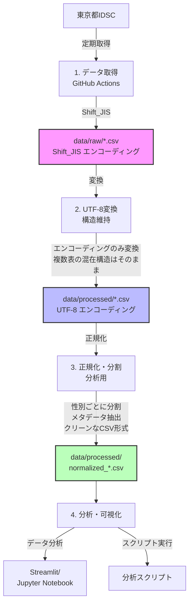
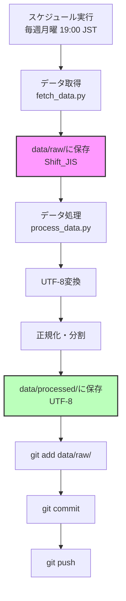
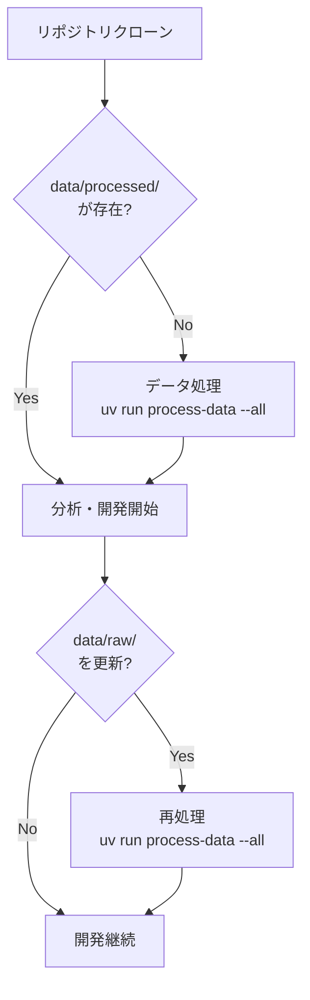
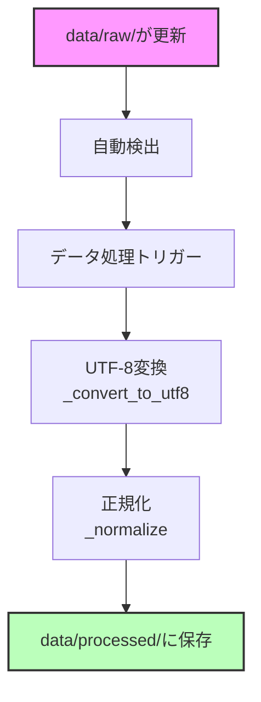

# data/ ディレクトリ構造設計

## 設計方針

1. **生データの保持**: Shift_JIS原本は必ず保持(再処理可能性)
2. **段階的処理**: raw → utf8 → normalized の3段階
3. **用途別分離**: 分析用・アーカイブ用で分ける
4. **メタデータ管理**: 各段階でメタデータを保持

## ディレクトリ構造

```
data/
├── raw/                          # 生データ(Shift_JIS、GitHub管理対象)
│   ├── .metadata/                # メタデータ(ハッシュインデックス等)
│   │   ├── hash_index.json
│   │   └── *.json
│   └── *.csv                     # 元データ(複雑な構造のまま)
│
├── processed/                    # 処理済み(UTF-8、フラット配置)
│   ├── .metadata/                # 処理済みファイルのメタデータ
│   │   └── normalized_*.json     # 各ファイルの個別メタデータ
│   │
│   # 全数報告
│   ├── notifiable_weekly_normalized_YYYY_WW.csv
│   │
│   # 定点監視(性別分割)
│   ├── sentinel_weekly_age_normalized_male_YYYY_WW.csv
│   ├── sentinel_weekly_age_normalized_female_YYYY_WW.csv
│   ├── sentinel_weekly_age_normalized_total_YYYY_WW.csv
│   │
│   # 定点監視(分割なし)
│   └── sentinel_weekly_gender_normalized_YYYY_WW.csv
│
├── backups/                      # バックアップ(.gitignore対象)
└── logs/                         # 処理ログ
```

**設計方針:**

- **MECE**: `raw/`(Shift_JIS原本)と `processed/`(UTF-8正規化済み)で明確に分離
- **超シンプル**: トップレベルは `raw/` と `processed/` の2つのみ
- **フラット**: 処理済みファイルは全て `processed/` 直下にフラット配置
- **ファイル名で分類**: ディレクトリ階層ではなくファイル名で種類を識別
- **中間ファイルなし**: UTF-8変換のみの中間ファイルは作らない(メモリ上で直接処理)

## データフロー



## ファイル命名規則

### raw/ (生データ)

```
{data_type}_{frequency}_{year}_{period:02d}.csv

例:
- sentinel_weekly_gender_2025_01.csv
- notifiable_weekly_2025_01.csv
```

### utf8/ (UTF-8版)

```
{data_type}_{frequency}_{year}_{period:02d}.csv

例:
- sentinel_weekly_gender_2025_01.csv (rawと同じ名前)
- notifiable_weekly_2025_01.csv
```

### normalized/ (正規化版)

```
{data_type}_{frequency}_{gender}_{year}_{period:02d}.csv

例:
- sentinel_weekly_gender_male_2025_01.csv
- sentinel_weekly_gender_female_2025_01.csv
- sentinel_weekly_gender_total_2025_01.csv
- sentinel_weekly_age_male_2025_01.csv
- notifiable_weekly_2025_01.csv (性別なし)
```

## メタデータ構造

### raw/.metadata/hash_index.json

```json
{
  "sha256_hash": "path/to/file.csv"
}
```

### utf8/.metadata/conversion_log.json

```json
{
  "conversions": [
    {
      "timestamp": "2025-12-02T10:00:00",
      "source": "data/raw/sentinel_weekly_gender_2025_01.csv",
      "destination": "data/utf8/sentinel_weekly_gender_2025_01.csv",
      "source_encoding": "shift_jis",
      "dest_encoding": "utf-8",
      "file_size_bytes": 12345,
      "success": true
    }
  ]
}
```

### normalized/.metadata/normalization_log.json

```json
{
  "normalizations": [
    {
      "timestamp": "2025-12-02T10:05:00",
      "source": "data/utf8/sentinel_weekly_gender_2025_01.csv",
      "outputs": [
        {
          "path": "data/normalized/sentinel/weekly/gender/male/sentinel_weekly_gender_male_2025_01.csv",
          "gender": "男性",
          "rows": 10,
          "columns": ["年齢区分", "インフルエンザ", "RSウイルス", ...]
        },
        {
          "path": "data/normalized/sentinel/weekly/gender/female/sentinel_weekly_gender_female_2025_01.csv",
          "gender": "女性",
          "rows": 10,
          "columns": ["年齢区分", "インフルエンザ", "RSウイルス", ...]
        }
      ],
      "success": true
    }
  ]
}
```

## .gitignore設定

```gitignore
# バックアップは除外
data/backups/

# 処理済みデータは除外(再生成可能)
data/utf8/
data/normalized/
data/processed/

# ログは除外
data/logs/*.txt

# 生データとメタデータは含める
!data/raw/
!data/raw/.metadata/
```

## 処理スクリプト

### scripts/convert_to_utf8.py

```bash
# 全rawデータをUTF-8に変換
uv run python scripts/convert_to_utf8.py --all

# 特定ファイルのみ変換
uv run python scripts/convert_to_utf8.py --file data/raw/sentinel_weekly_gender_2025_01.csv
```

### scripts/normalize_data.py

```bash
# 全UTF-8データを正規化
uv run python scripts/normalize_data.py --all

# 特定カテゴリのみ正規化
uv run python scripts/normalize_data.py --category sentinel --frequency weekly

# ドライラン
uv run python scripts/normalize_data.py --all --dry-run
```

## データ容量の見積もり

| ディレクトリ     | 容量見積もり | GitHub管理 | 説明                 |
| ---------------- | ------------ | ---------- | -------------------- |
| data/raw/        | 50-100MB     | ✅ Yes     | Shift_JIS原本        |
| data/utf8/       | 50-100MB     | ❌ No      | UTF-8変換(再生成可)  |
| data/normalized/ | 100-200MB    | ❌ No      | 正規化版(再生成可)   |
| data/backups/    | 可変         | ❌ No      | ローカルバックアップ |

## 運用フロー

### 定期データ取得時(GitHub Actions)



### ローカル開発時



### データ更新時



## 利点

1. **トレーサビリティ**: raw → utf8 → normalized の履歴が明確
2. **再現性**: rawさえあれば全データを再生成可能
3. **柔軟性**: 正規化ロジック変更時も簡単に再処理
4. **効率性**: 用途に応じて適切なデータを選択
5. **Git管理**: 原本のみをバージョン管理、容量を抑制
