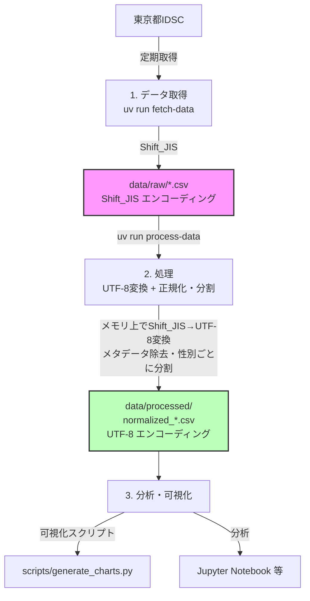
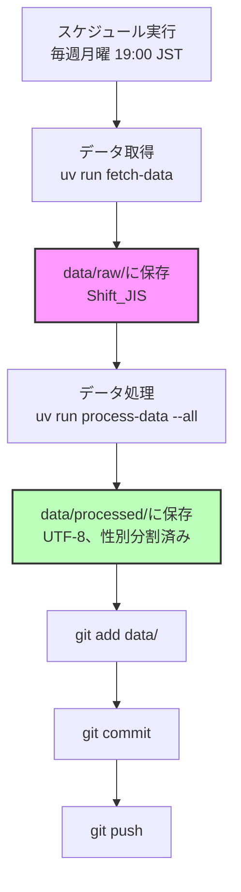
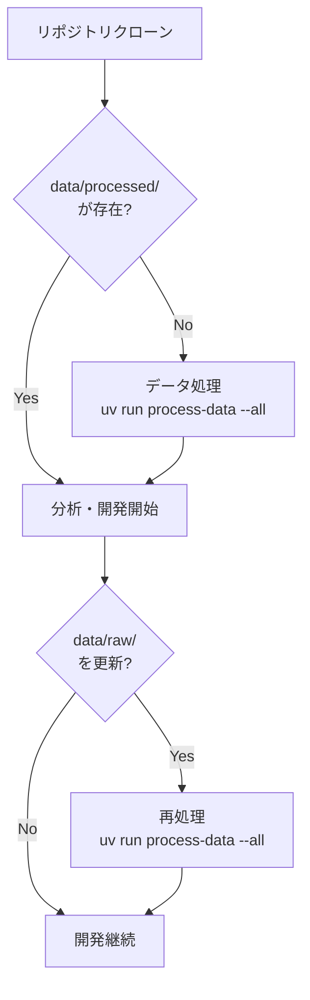
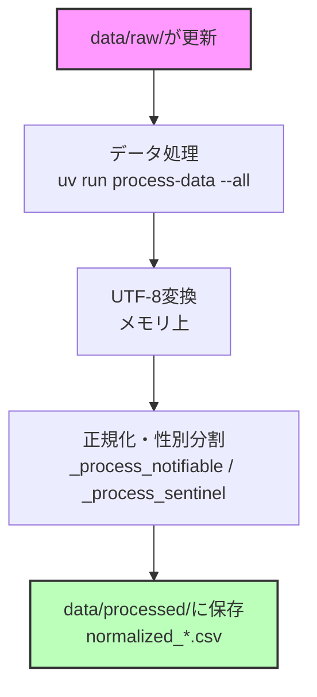

# data/ ディレクトリ構造設計

## 設計方針

1. **生データの保持**: Shift_JIS原本は必ず保持 (再処理可能性)
2. **2段構造**: `raw/` (Shift_JIS原本) と `processed/` (UTF-8正規化済み) の2段階
3. **中間ファイルなし**: UTF-8変換のみの中間ファイルは作らない (メモリ上で直接処理)
4. **メタデータ管理**: 各段階でファイルごとにメタデータを保持

## ディレクトリ構造

```text
data/
├── raw/                                                   # 生データ (Shift_JIS、GitHub管理対象)
│   ├── .metadata/                                         # メタデータ (ハッシュインデックス等)
│   │   ├── hash_index.json                                # 重複チェック用ハッシュインデックス
│   │   └── *.json                                         # 各生データファイルの個別メタデータ
│   └── *.csv                                              # 元データ (複雑な構造のまま)
├── processed/                                             # 処理済み (UTF-8、フラット配置、GitHub管理対象)
│   ├── .metadata/                                         # 処理済みファイルのメタデータ
│   │   └── normalized_*.json                              # 各出力ファイルの個別メタデータ
│   ├── stats.json                                         # 直近の処理統計 (process-data が出力)
│   ├── normalized_notifiable_weekly_2000_01.csv           # 全数報告 (UTF-8、メタデータ除去)
│   ├── normalized_sentinel_weekly_age_male_2000_01.csv    # 定点・年齢群・男性 (UTF-8)
│   ├── normalized_sentinel_weekly_age_female_2000_01.csv  # 定点・年齢群・女性 (UTF-8)
│   ├── normalized_sentinel_weekly_age_total_2000_01.csv   # 定点・年齢群・合計 (UTF-8、元データの値を検証済み)
│   └── normalized_sentinel_weekly_gender_2000_01.csv      # 定点・性別 (UTF-8、性別列形式のため分割なし)
└── logs/                                                  # 処理ログ
```

**設計方針:**

- **MECE**: `raw/` (Shift_JIS原本) と `processed/` (UTF-8正規化済み) で明確に分離
- **超シンプル**: トップレベルは `raw/` と `processed/` の2つ (および `logs/`) のみ
- **フラット**: 処理済みファイルは全て `processed/` 直下にフラット配置
- **ファイル名で分類**: ディレクトリ階層ではなくファイル名で種類を識別
- **中間ファイルなし**: UTF-8変換と正規化・分割を `process-data` が一度に実行し、中間の `utf8/` ディレクトリは作らない (メモリ上で直接処理)

## データフロー

UTF-8変換と正規化・分割は `uv run process-data` (`src/cli/process_data.py` → `src/processors/data_processor.py`) が1つの処理として実行します。



## ファイル命名規則

### raw/ (生データ)

```text
{data_type}_{frequency}_{year}_{period:02d}.csv

例:
- sentinel_weekly_gender_2025_01.csv
- sentinel_weekly_age_2025_01.csv
- notifiable_weekly_2025_01.csv
- sentinel_monthly_age_2025_01.csv
```

> 注: `data_type` は `category` と `frequency` と集計軸を連結したもの。実装上は `category` (`notifiable` / `sentinel`) と `frequency` (`weekly` / `monthly`)、集計軸 (`gender` / `age` / `health_center` / `medical_district`) を組み合わせます。

### processed/ (正規化版)

実際の出力ファイル名は `normalized_` 接頭辞を付与します (実装: `src/processors/data_processor.py`)。

```text
# 全数報告 (シンプル)
normalized_{category}_{frequency}_{year}_{period}.csv
例: normalized_notifiable_weekly_2000_01.csv

# 定点監視 (性別分割あり)
normalized_{category}_{frequency}_{aggregation}_{gender}_{year}_{period}.csv
例:
- normalized_sentinel_weekly_age_male_2000_01.csv
- normalized_sentinel_weekly_age_female_2000_01.csv
- normalized_sentinel_weekly_age_total_2000_01.csv

# 定点監視 (分割なし: 性別が列形式の場合)
normalized_{category}_{frequency}_{aggregation}_{year}_{period}.csv
例: normalized_sentinel_weekly_gender_2000_01.csv
```

**gender パラメータ:** `male` (男性)、`female` (女性)、`total` (男女合計)。
ただし `medical_district` は元データに男女合計セクションが含まれないため `total` を出力しません。

## メタデータ構造

メタデータは「ログファイル1本」ではなく、**ファイルごとの個別JSON** として `.metadata/` 配下に保存されます。スキーマの完全な定義は [`CLAUDE.md`](../CLAUDE.md#83-メタデータスキーマ-v130) を参照してください (実装: `src/models/metadata.py`、`METADATA_VERSION = "1.3.0"`)。

### raw/.metadata/hash_index.json

重複検出用のSHA256ハッシュとファイルパスのマッピング (実装: `src/managers/storage_manager.py`)。
同一ハッシュに複数パスが対応する場合はリストになります。

```json
{
  "<sha256_hash>": "data/raw/sentinel_weekly_gender_2025_01.csv"
}
```

### raw/.metadata/{filename}.json (生データの個別メタデータ)

生データファイルごとに、ファイル名の `.csv` を `.json` に置き換えた個別メタデータが保存されます。
(例: `sentinel_weekly_age_2025_01.json`)

```json
{
  "metadata_version": "1.3.0",
  "name": "sentinel_weekly_age_2025_01",
  "filename": "sentinel_weekly_age_2025_01.csv",
  "path": "sentinel_weekly_age_2025_01.csv",
  "profile": "tokyo-idsc-raw",
  "data_type": "sentinel_weekly_age",
  "temporal": { "year": 2025, "period": 1, "period_type": "weekly" },
  "bytes": 12345,
  "lines": 30,
  "hash": { "algorithm": "sha256", "value": "<sha256>" },
  "encoding": "shift_jis",
  "created": "2025-12-02T10:00:00+00:00",
  "modified": "2025-12-02T10:00:00+00:00",
  "sources": [{ "title": "Tokyo IDSC", "path": "<source_url>" }],
  "verification": { "status": "verified", "checks": {}, "errors": [], "warnings": [], "details": {} },
  "quality": { "validation_timestamp": "...", "validation_status": "completed", "issues": [] },
  "_fetch": {
    "source_url": "<source_url>",
    "fetch_time_seconds": 1.23,
    "force_overwrite": false,
    "save_all_zero": false
  }
}
```

### processed/.metadata/{output_stem}.json (処理済みファイルの個別メタデータ)

正規化後の出力ファイルごとに、`{出力ファイル名(拡張子なし)}.json` のメタデータが保存されます。
(例: `normalized_sentinel_weekly_age_male_2000_01.json`)

```json
{
  "metadata_version": "1.3.0",
  "name": "normalized_sentinel_weekly_age_male_2000_01",
  "filename": "normalized_sentinel_weekly_age_male_2000_01.csv",
  "path": "processed/normalized_sentinel_weekly_age_male_2000_01.csv",
  "profile": "tokyo-idsc-processed",
  "data_type": "sentinel_weekly_age",
  "temporal": { "year": 2000, "period": 1, "period_type": "weekly" },
  "bytes": 6789,
  "lines": 12,
  "hash": { "algorithm": "sha256", "value": "<sha256>" },
  "encoding": "utf-8",
  "created": "2025-12-02T10:05:00+00:00",
  "modified": "2025-12-02T10:05:00+00:00",
  "sources": [{ "title": "sentinel_weekly_age_2000_01.csv", "path": "raw/sentinel_weekly_age_2000_01.csv" }],
  "_process": {
    "source_name": "sentinel_weekly_age_2000_01",
    "source_hash": "<source_sha256>",
    "processing_time_seconds": 0.05,
    "gender": "male"
  },
  "quality": { "validation_timestamp": "...", "validation_status": "completed", "issues": [] }
}
```

### processed/stats.json (処理統計)

`process-data` 実行のたびに、直近の処理結果サマリーが上書き保存されます (実装: `src/cli/process_data.py`)。

```json
{
  "total": 100,
  "succeeded": 100,
  "failed": 0,
  "errors": []
}
```

## .gitignore設定

`data/raw/` と `data/processed/` は **どちらもGitHub管理対象** です (再生成可能ですが、クローン直後に分析を始められるよう処理済みデータもコミットします)。`.gitignore` ではこれらを除外していません。

データ関連で `.gitignore` が除外しているのは、プロジェクト用の作業ディレクトリのみです (実装: リポジトリ直下の `.gitignore`)。

```gitignore
# Project specific
# Data artifacts
data/dummy/
data/output/
```

## 処理スクリプト

UTF-8変換と正規化は専用スクリプトに分かれておらず、`process-data` コマンドが両方を一度に実行します。
(エントリポイント定義: `pyproject.toml` の `[project.scripts]`、実装: `src/cli/process_data.py`)

```bash
# raw/配下の全CSVを処理 (UTF-8変換 + 正規化・分割)
uv run process-data --all

# 特定ファイルのみ処理 (1個以上、スペース区切り。data/raw/配下のみ対象)
uv run process-data --files data/raw/sentinel_weekly_gender_2025_01.csv

# 複数ファイルを処理
uv run process-data --files file1.csv file2.csv file3.csv

# ドライラン (実際の処理は行わない)
uv run process-data --all --dry-run

# 詳細ログ
uv run process-data --all --verbose
```

## データ容量の見積もり

| ディレクトリ    | GitHub管理 | 説明                                 |
| --------------- | ---------- | ------------------------------------ |
| data/raw/       | ✅ Yes     | Shift_JIS原本                        |
| data/processed/ | ✅ Yes     | UTF-8正規化版 (rawから再生成可)      |
| data/logs/      | 一部       | 処理ログ (`*.log` 等はgitignore対象) |

## 運用フロー

### 定期データ取得時 (GitHub Actions)



### ローカル開発時



### データ更新時



## 利点

1. **トレーサビリティ**: 各処理済みファイルのメタデータに元ファイル名・ハッシュ (`_process.source_name` / `source_hash`) を記録
2. **再現性**: rawさえあれば `process-data` で全データを再生成可能
3. **柔軟性**: 正規化ロジック変更時も簡単に再処理
4. **効率性**: 用途に応じて raw / processed を選択
5. **Git管理**: 原本と処理済みデータの両方をバージョン管理
