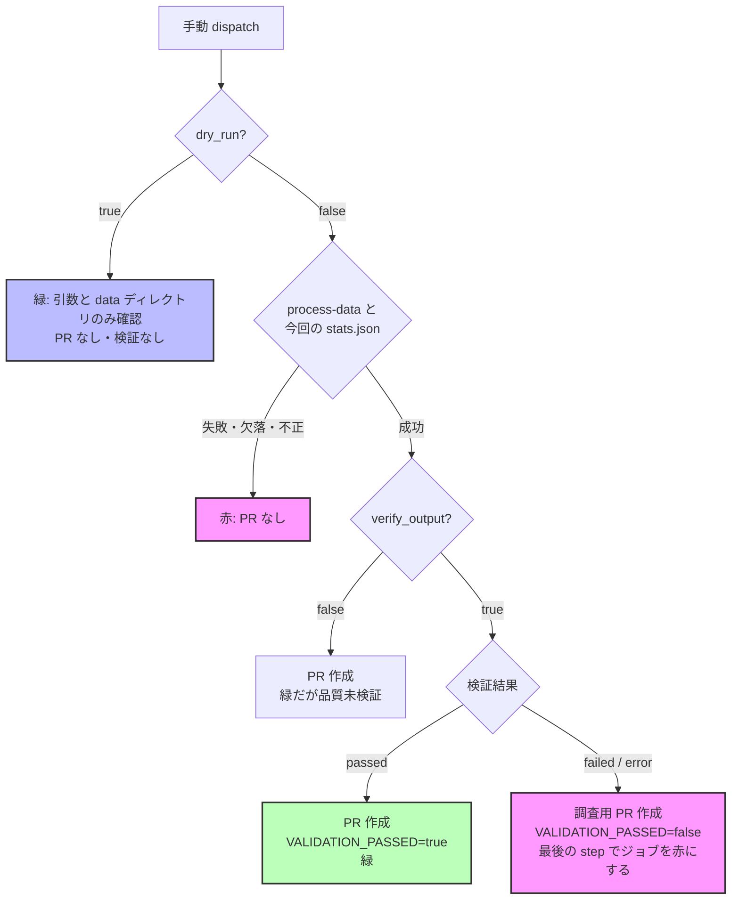

# 手動データ処理 (process-data.yml) の結果の読み方と backfill 手順

`.github/workflows/process-data.yml` を手動実行 (`workflow_dispatch`) して raw → processed を再生成するときの、入力の意味・ジョブ結論の意味・成功条件をまとめる (issue #774)。

## 1. 入力が保証すること / しないこと

| 入力            | true のとき                                                                                                                                                                                               | false のとき                                                                                     |
| --------------- | --------------------------------------------------------------------------------------------------------------------------------------------------------------------------------------------------------- | ------------------------------------------------------------------------------------------------ |
| `dry_run`       | 引数と `data/` ディレクトリの存在**だけ**を確認する。対象ファイルの存在確認・変換・品質検証・コミット・PR 作成はしない。既存の `stats.json` は今回の結果ではないので読まない (Summary にも件数を出さない) | 実際に変換し、変更があれば PR を作る                                                             |
| `verify_output` | 変換後に `validate-data` を実行し、結果を `passed` / `failed` / `error` で記録する。`passed` 以外なら調査用 PR を作った後でジョブを失敗させる                                                             | 品質検証をしない。ジョブが緑でも**品質は未検証**であり、Summary にもそう表示する                 |
| `auto_merge`    | `scripts/auto_merge_gate.sh` のゲートを満たしたときだけ PR に自動マージを設定する                                                                                                                         | 自動マージを設定しない (人がマージする)                                                          |
| `target_files`  | カンマ区切りの raw パス (`data/raw/xxx.csv,data/raw/yyy.csv`)。空白区切りや改行区切りは 1 つのパスとして扱われる                                                                                          | **空欄は全 raw (`--all`) の処理になる**。一覧が空になったことを「全件処理」に変えないこと (4 章) |

ドライランは「処理しない確認」であり、変換の予行にはならない。実変換を事前に試すときは、コミット済みの `data/` を変更しないよう、隔離コピーに対してローカルで実行する。

```bash
(
  set -eu -o pipefail
  WORK="$(mktemp -d)"
  cp -R data "$WORK/data"
  uv run --locked process-data --data-dir "$WORK/data" --files "$WORK/data/raw/notifiable_weekly_2025_01.csv"
  uv run --locked validate-data "$WORK/data/processed" --encoding utf-8 --format json --output "$WORK/validation.json"
  echo "予行結果: $WORK"
)
```

## 2. 処理結果と品質検証の状態

Summary の「📊 処理結果」と「🔍 品質検証」は別々に表示される。ジョブの緑は「処理に成功し、かつ要求された検証が合格した (または検証を要求していない)」ことだけを意味する。

| 処理結果 (`PROCESS_RESULT`) | 意味                                                                                                                  |
| --------------------------- | --------------------------------------------------------------------------------------------------------------------- |
| `success`                   | `process-data` が正常終了し、今回の処理が新しく書いた `stats.json` が妥当 (件数が非負整数で `成功 + 失敗 = 処理対象`) |
| `dry_run`                   | ドライラン。引数と data ディレクトリの存在のみ確認した                                                                |
| `failed`                    | `process-data` が非 0 で終了した、または今回の `stats.json` が生成されていないか不正。ジョブは失敗し、PR は作らない   |

| 品質検証 (`VALIDATION_STATUS`) | 条件                                                                                                                                                   | `VALIDATION_PASSED` |
| ------------------------------ | ------------------------------------------------------------------------------------------------------------------------------------------------------ | ------------------- |
| `not_requested`                | `verify_output=false`                                                                                                                                  | 未設定              |
| `not_run`                      | `verify_output=true` だが、ドライランまたは処理が成功しなかったため実行していない                                                                      | 未設定              |
| `passed`                       | `validate-data` が終了コード 0 で、JSON レポートの形と件数が一貫し (1 件以上、`有効 + 無効 = 総数 = results の件数`)、無効 0 件かつ `has_errors=false` | `true`              |
| `failed`                       | `validate-data` が終了コード 1 で、形と件数が一貫した JSON レポートが無効 1 件以上かつ `has_errors=true`                                               | `false`             |
| `error`                        | 上記以外。異常終了、レポートの欠落・不正・不完全、検証 0 件、件数の不一致、終了コードとレポートの食い違いを含む (検証できなかったことを示す)           | `false`             |

全件の検証結果 (10MB 超) は runner の一時領域にだけ置き、PR には要約・終了コード・状態・無効ファイルだけの `data/logs/validation_report_<timestamp>.json` を残す。Summary には無効ファイルを最大 20 件表示する。

`validate-data` の検出範囲そのもの (何を不合格として検出できるか) はこの手順では保証しない (#730 / #739 FU-B2)。

## 3. ジョブ結論・PR・自動マージ・手動マージの判断



| 状態                          | ジョブ結論 | PR                       | `auto_merge=true` のとき   | 人の手動マージ                           |
| ----------------------------- | ---------- | ------------------------ | -------------------------- | ---------------------------------------- |
| ドライラン                    | 成功       | 作らない                 | -                          | -                                        |
| 処理失敗 / stats 欠落・不正   | 失敗       | 作らない                 | -                          | -                                        |
| 処理成功 + `not_requested`    | 成功       | 変更があれば作る         | 既存ゲートどおり設定される | 品質未検証。backfill では使わない (4 章) |
| 処理成功 + `passed`           | 成功       | 変更があれば作る         | ゲートを満たせば設定される | 5 章の差分確認の後で可                   |
| 処理成功 + `failed` / `error` | 失敗       | 変更があれば調査用に作る | `validation` で blocked    | **原因を確認するまでマージしない**       |

- 検証の不合格/検証不能は、調査用 PR とサマリー・ログを残した後の最終 step (`Enforce validation result`) でジョブを失敗させる。処理エラー通知 (`Create issue on error`) とは区別される
- `verify_output=false` の自動マージ条件は変更していない (`auto_merge_gate.sh` は `not_requested` を blocker にしない)。process-data には強制上書き (`force_merge_on_failure`) の入力は無い

## 4. backfill の通常手順

通常の dispatch は **`dry_run=false`、`verify_output=true`、`auto_merge=false` を必ず明示する** (既定値に頼らない)。

各コマンドはサブシェル内で `set -eu -o pipefail` を有効にして、前提を 1 つでも満たさなければその場で止まる。`( ... ) || echo` や `if ! ( ... )` のようにサブシェルを条件式の中に置くと、bash / zsh とも中の `set -e` が無効になり、失敗しても後続の行が実行される。この章のブロックは条件式に入れず、そのまま実行する。`process_data_dispatch apply || ...` のように関数の呼び出しに `||` / `&&` を付けるのも同じ理由で禁止する (前提の失敗で止まらずに dispatch してしまう)。

### 4.1 dispatch 関数を定義する

次のブロックは関数を定義するだけで、何も実行しない (zsh / bash 共通)。関数は呼ばれるたびに、main の最新化・対象一覧の再生成・形式/重複/件数/入力サイズの確認・未マージの data PR と先行 run の不在確認をやり直し、すべて満たしたときだけ `apply` で dispatch する。前段の結果やファイルを再利用しない。

<!-- runbook: dispatch-function -->

```bash
process_data_dispatch() (
  set -eu -o pipefail
  # 呼び出し元の WORK を引き継がない (trap が消すのはこの関数が作った一時ディレクトリだけ)
  WORK=""
  trap 'rc=$?; [ -z "${WORK:-}" ] || rm -rf "$WORK"; if [ "$rc" -ne 0 ]; then echo "STOP: 前提を満たさないか途中で失敗しました (exit $rc)。dispatch していません" >&2; fi' EXIT
  MODE="${1:-}"
  BATCH_SIZE=500
  MAX_INPUT_BYTES=60000
  case "$MODE" in
    preview | apply) ;;
    *) echo "引数は preview か apply を指定してください" >&2; exit 2 ;;
  esac

  # main を最新にする (clean な main の checkout でだけ進む)
  BRANCH="$(git branch --show-current)"
  test "$BRANCH" = main
  DIRTY="$(git status --porcelain)"
  test -z "$DIRTY"
  git fetch origin main
  git merge --ff-only origin/main
  HEAD_SHA="$(git rev-parse HEAD)"
  MAIN_SHA="$(git rev-parse origin/main)"
  test "$HEAD_SHA" = "$MAIN_SHA"
  uv sync --locked

  # 対象一覧を毎回作り直す。失敗・空・data/raw/*.csv 以外の行・重複があれば止める
  WORK="$(mktemp -d)"
  uv run --locked check-data-status --list-needs-processing > "$WORK/all.txt"
  if [ ! -s "$WORK/all.txt" ]; then
    echo "対象一覧が空です。空の target_files は全件処理になるので dispatch しません" >&2
    exit 1
  fi
  if grep -Ev '^data/raw/[^/,[:space:]]+\.csv$' "$WORK/all.txt" >&2; then
    echo "data/raw/*.csv 以外の行があります" >&2
    exit 1
  fi
  TOTAL="$(wc -l < "$WORK/all.txt" | tr -d ' ')"
  UNIQUE="$(sort -u "$WORK/all.txt" | wc -l | tr -d ' ')"
  test "$TOTAL" -eq "$UNIQUE"

  # 先頭の BATCH_SIZE 件だけを今回のバッチにし、入力サイズを確認する (workflow_dispatch の入力は合計 65,535 文字まで)
  head -n "$BATCH_SIZE" "$WORK/all.txt" > "$WORK/batch.txt"
  COUNT="$(wc -l < "$WORK/batch.txt" | tr -d ' ')"
  test "$COUNT" -gt 0
  TARGET_FILES="$(paste -sd, - < "$WORK/batch.txt")"
  INPUT_BYTES="$(printf '%s' "$TARGET_FILES" | wc -c | tr -d ' ')"
  if [ "$INPUT_BYTES" -gt "$MAX_INPUT_BYTES" ]; then
    echo "入力が ${INPUT_BYTES} bytes で上限 ${MAX_INPUT_BYTES} を超えます。BATCH_SIZE を下げてください" >&2
    exit 1
  fi

  # 前のバッチの data PR (data-process-*) が open のままなら止める (同じ stats.json を更新して競合するため)。
  # 件数上限で切り捨てないよう、open PR を全ページ取得してから絞り込む
  OPEN_PRS="$(gh api --paginate "repos/{owner}/{repo}/pulls?state=open&per_page=100" --jq '.[] | select(.head.ref | startswith("data-process-")) | .number' | wc -l | tr -d ' ')"
  test "$OPEN_PRS" -eq 0
  # 未完了の process-data run があれば止める (concurrency の cancel-in-progress で先行 run が消えるため)。
  # 状態ごとにサーバー側で絞り込み、全ページを数える
  for RUN_STATUS in queued in_progress waiting requested pending; do
    RUNS="$(gh api --paginate "repos/{owner}/{repo}/actions/workflows/process-data.yml/runs?status=${RUN_STATUS}&per_page=100" --jq '.workflow_runs[].id' | wc -l | tr -d ' ')"
    test "$RUNS" -eq 0
  done

  echo "main: $HEAD_SHA"
  echo "対象: 全 ${TOTAL} 件のうち今回 ${COUNT} 件 / 入力 ${INPUT_BYTES} bytes"
  if [ "$MODE" = preview ]; then
    echo "preview: dispatch していません"
    exit 0
  fi
  gh workflow run process-data.yml --ref main \
    -f target_files="$TARGET_FILES" \
    -f dry_run=false \
    -f verify_output=true \
    -f auto_merge=false
  echo "dispatch しました。4.3 で run の完了まで待ってください"
)
```

- 引数 (`preview` / `apply`) は省略できない。省略・不正値なら何も確認せずに止まる
- `BATCH_SIZE` (1 回の dispatch に渡す最大件数) は 500、`MAX_INPUT_BYTES` は 60000
- 一覧が空でも完了とは限らない。再処理では直せない raw (未対応のファイル名・処理できない内容など) は一覧から除外されるが、`--fail-on-incomplete` では失敗する。空のときは `uv run --locked check-data-status --fail-on-incomplete` で状態を確認する

### 4.2 preview で件数を確認し、apply で dispatch する

preview は dispatch しない以外は apply と同じ確認を行う。表示された全体件数と今回件数を控える。

<!-- runbook: dispatch-preview -->

```bash
process_data_dispatch preview
```

問題が無ければ apply で dispatch する。apply は確認をすべてやり直す。

<!-- runbook: dispatch-apply -->

```bash
process_data_dispatch apply
```

全体が `BATCH_SIZE` を超えるときは、今回のバッチの run 完了 (4.3)・結果確認 (4.4)・差分確認 (5 章) の後に人が data PR をマージし、それから preview / apply をもう一度行う。各 run は同じ `data/processed/stats.json` を更新するので、前のバッチの PR をマージする前に次を dispatch すると PR 同士が競合する。apply は open の `data-process-*` PR があれば止まり、毎回最新の main から一覧を作り直すので、処理済みの raw は次のバッチに含まれない。

### 4.3 run の完了まで待つ

`concurrency` は `group: process-data`、`cancel-in-progress: true` なので、実行中の run があるときに dispatch すると**先行 run がキャンセルされる**。apply は未完了の run があれば止まるが、確認から dispatch までの間は排他されない。apply は 1 人が 1 つの checkout から 1 回ずつ実行し、複数の端末や人で同時に実行しない。キャンセルされた run は結論が `cancelled` になり PR を作らない (データは変わらない) ので、4.4 で結論を確認し、キャンセルされていたら preview / apply からやり直す。

```bash
gh run list --workflow process-data.yml --limit 3 --json databaseId,status,createdAt,event
gh run watch <run-id> --exit-status
```

### 4.4 結果を確認する

Summary で次をすべて確認する。1 つでも満たさなければ PR をマージしない。

- 「処理: ✅ 成功」で、処理対象件数が apply で表示された今回件数と一致し、失敗 0 件・スキップ 0 件
- 「品質検証: ✅ 合格」 (`passed`)。`failed` / `error` / 未実施は合格扱いしない。ジョブは赤になり、PR は調査用として残る
- ジョブ結論が成功

## 5. PR の差分確認

`git add data/` で PR を作るので、processed の変更に加えて今回の run の検証レポート (`data/logs/validation_report_*.json`) も PR に入る。「変更は data/processed だけ」を合否条件にしない。`data/logs/console_*.log` は `.gitignore` の `*.log` で除外されるので PR には入らず、run の logs artifact (`process-logs-<timestamp>`) でだけ確認できる。差分の一覧はローカルの git で取る。`gh pr diff` (`--name-only` を含む) は変更ファイルが 300 を超える PR で HTTP 406 になり、1 batch で 1,000 ファイルを超える通常の data PR では使えない。リポジトリの clone 内で、`PR_NUMBER` に data PR の番号を入れてから実行する (空なら止まる)。PR が main 向けの open な `data-process-*` PR であること、取得した commit が PR の現在の head と一致することを確認してから、最新の origin/main との差分を件数の上限なしで全件数える。`git fetch` はリモート追跡参照と `FETCH_HEAD` を更新するだけで、作業ツリーとローカルの main は変えない。

<!-- runbook: pr-diff -->

```bash
(
  set -eu -o pipefail
  PR_NUMBER=""
  case "$PR_NUMBER" in '' | *[!0-9]*) echo "PR_NUMBER を設定してください" >&2; exit 2 ;; esac
  PR_INFO="$(gh api "repos/{owner}/{repo}/pulls/$PR_NUMBER" --jq '"\(.state) \(.base.ref) \(.head.ref) \(.head.sha)"')"
  read -r PR_STATE BASE_REF HEAD_REF HEAD_SHA <<< "$PR_INFO"
  if [ "$PR_STATE" != open ] || [ "$BASE_REF" != main ]; then
    echo "STOP: main 向けの open な PR ではありません ($PR_INFO)" >&2
    exit 1
  fi
  case "$HEAD_REF" in data-process-*) ;; *) echo "STOP: data-process-* ブランチの PR ではありません ($HEAD_REF)" >&2; exit 1 ;; esac
  git fetch origin main
  git fetch origin "pull/$PR_NUMBER/head"
  FETCHED="$(git rev-parse FETCH_HEAD)"
  if [ "$FETCHED" != "$HEAD_SHA" ]; then
    echo "STOP: 取得した commit ($FETCHED) が PR の head ($HEAD_SHA) と一致しません" >&2
    exit 1
  fi
  DIFF="$(mktemp)"
  trap 'rm -f "$DIFF"' EXIT
  git diff --no-renames --name-only "origin/main...$HEAD_SHA" > "$DIFF"
  test -s "$DIFF"
  echo "変更ファイル総数:   $(wc -l < "$DIFF" | tr -d ' ')"
  echo "processed CSV:      $(grep -cE '^data/processed/normalized_[^/]+\.csv$' "$DIFF" || true)"
  echo "processed metadata: $(grep -cE '^data/processed/\.metadata/normalized_[^/]+\.json$' "$DIFF" || true)"
  echo "stats.json:         $(grep -cE '^data/processed/stats\.json$' "$DIFF" || true)"
  echo "検証レポート:       $(grep -cE '^data/logs/validation_report_[^/]+\.json$' "$DIFF" || true)"
  if grep -vE '^data/processed/(normalized_[^/]+\.csv|\.metadata/normalized_[^/]+\.json|stats\.json)$|^data/logs/validation_report_[^/]+\.json$' "$DIFF"; then
    echo "STOP: 想定外のファイルがあります (raw・コード・設定など)" >&2
    exit 1
  fi
  echo "想定外のファイルはありません"
)
```

終了コードが 0 以外、または `STOP:` が出たら、原因を確認するまでマージしない。

| 区分               | パス                                         | 確認すること                                                                 |
| ------------------ | -------------------------------------------- | ---------------------------------------------------------------------------- |
| processed CSV      | `data/processed/normalized_*.csv`            | 対象 raw に対応するものだけか。性別分割される種別は 1 raw から複数出力される |
| processed metadata | `data/processed/.metadata/normalized_*.json` | processed CSV と対応しているか                                               |
| 処理統計           | `data/processed/stats.json`                  | 今回の run の件数と一致するか                                                |
| 検証レポート       | `data/logs/validation_report_*.json`         | 今回の run のタイムスタンプの 1 件だけか。`validation_status` が `passed` か |
| 想定外             | 上記以外 (`data/raw/`、コード、設定など)     | 1 件でもあれば原因を確認するまでマージしない                                 |

対象と無関係な processed の大量再生成があれば原因を確認する。「約 1,000 ファイル」のような過去の目安だけで合否を決めない。

## 6. マージ後の完全性確認

data PR を人がマージした後、**その PR を含む最新の main** で完全性ゲートを確認する。`MERGE_COMMIT` に data PR のマージコミット SHA を入れてから実行する (空なら止まる)。ローカルの main が origin/main と一致しない (先行・遅延) ときは止まる。

<!-- runbook: post-merge -->

```bash
(
  set -eu -o pipefail
  MERGE_COMMIT=""
  test -n "$MERGE_COMMIT"
  BRANCH="$(git branch --show-current)"
  test "$BRANCH" = main
  DIRTY="$(git status --porcelain)"
  test -z "$DIRTY"
  git fetch origin main
  git merge --ff-only origin/main
  HEAD_SHA="$(git rev-parse HEAD)"
  MAIN_SHA="$(git rev-parse origin/main)"
  test "$HEAD_SHA" = "$MAIN_SHA"
  git merge-base --is-ancestor "$MERGE_COMMIT" HEAD
  uv sync --locked
  uv run --locked check-data-status --fail-on-incomplete
  echo "最新 main で完全性ゲートを満たしています"
)
```

終了コードが 0 以外なら完了ではない。`uv run --locked check-data-status --verbose` で残りの raw を確認し、再処理で直せるもの (`--list-needs-processing` に出るもの) は 4 章をもう一度行う。再処理で直せないものは別途原因を調べる。
