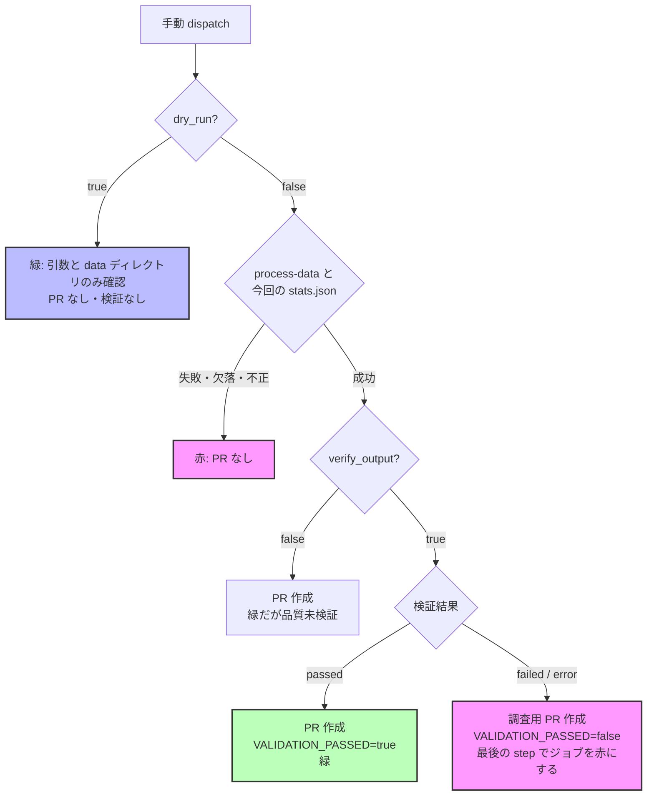

# 手動データ処理 (process-data.yml) の結果の読み方と backfill 手順

`.github/workflows/process-data.yml` を手動実行 (`workflow_dispatch`) して raw → processed を再生成するときの、入力の意味・ジョブ結論の意味・成功条件をまとめる (issue #774)。

## 1. 入力が保証すること / しないこと

| 入力            | true のとき                                                                                                                                                                                               | false のとき                                                                                     |
| --------------- | --------------------------------------------------------------------------------------------------------------------------------------------------------------------------------------------------------- | ------------------------------------------------------------------------------------------------ |
| `dry_run`       | 引数と `data/` ディレクトリの存在**だけ**を確認する。対象ファイルの存在確認・変換・品質検証・コミット・PR 作成はしない。既存の `stats.json` は今回の結果ではないので読まない (Summary にも件数を出さない) | 実際に変換し、変更があれば PR を作る                                                             |
| `verify_output` | 変換後に `validate-data` を実行し、結果を `passed` / `failed` / `error` で記録する。`passed` 以外なら調査用 PR を作った後でジョブを失敗させる                                                             | 品質検証をしない。ジョブが緑でも**品質は未検証**であり、Summary にもそう表示する                 |
| `auto_merge`    | `scripts/auto_merge_gate.sh` のゲートを満たしたときだけ PR に自動マージを設定する                                                                                                                         | 自動マージを設定しない (人がマージする)                                                          |
| `target_files`  | カンマ区切りの raw パス (`data/raw/xxx.csv,data/raw/yyy.csv`)。空白区切りや改行区切りは 1 つのパスとして扱われる                                                                                          | **空欄は全 raw (`--all`) の処理になる**。一覧が空になったことを「全件処理」に変えないこと (4 章) |

ドライランは「処理しない確認」であり、変換の予行にはならない。実変換を事前に試すときは、コミット済みの `data/` を変更しないよう、隔離コピーに対してローカルで実行する。

```bash
(
  set -eu -o pipefail
  WORK="$(mktemp -d)"
  cp -R data "$WORK/data"
  uv run --locked process-data --data-dir "$WORK/data" --files "$WORK/data/raw/notifiable_weekly_2025_01.csv"
  uv run --locked validate-data "$WORK/data/processed" --encoding utf-8 --format json --output "$WORK/validation.json"
  echo "予行結果: $WORK"
)
```

## 2. 処理結果と品質検証の状態

Summary の「📊 処理結果」と「🔍 品質検証」は別々に表示される。ジョブの緑は「処理に成功し、かつ要求された検証が合格した (または検証を要求していない)」ことだけを意味する。

| 処理結果 (`PROCESS_RESULT`) | 意味                                                                                                                  |
| --------------------------- | --------------------------------------------------------------------------------------------------------------------- |
| `success`                   | `process-data` が正常終了し、今回の処理が新しく書いた `stats.json` が妥当 (件数が非負整数で `成功 + 失敗 = 処理対象`) |
| `dry_run`                   | ドライラン。引数と data ディレクトリの存在のみ確認した                                                                |
| `failed`                    | `process-data` が非 0 で終了した、または今回の `stats.json` が生成されていないか不正。ジョブは失敗し、PR は作らない   |

| 品質検証 (`VALIDATION_STATUS`) | 条件                                                                                                                   | `VALIDATION_PASSED` |
| ------------------------------ | ---------------------------------------------------------------------------------------------------------------------- | ------------------- |
| `not_requested`                | `verify_output=false`                                                                                                  | 未設定              |
| `not_run`                      | `verify_output=true` だが、ドライランまたは処理が成功しなかったため実行していない                                      | 未設定              |
| `passed`                       | `validate-data` が終了コード 0 で、JSON レポートが 1 件以上を検証し `has_errors=false`                                 | `true`              |
| `failed`                       | `validate-data` が終了コード 1 で、JSON レポートが `has_errors=true`                                                   | `false`             |
| `error`                        | 上記以外。異常終了、レポートの欠落・不正、検証 0 件、終了コードとレポートの食い違いを含む (検証できなかったことを示す) | `false`             |

`validate-data` の検出範囲そのもの (何を不合格として検出できるか) はこの手順では保証しない (#730 / #739 FU-B2)。

## 3. ジョブ結論・PR・自動マージ・手動マージの判断



| 状態                          | ジョブ結論 | PR               | `auto_merge=true` のとき   | 人の手動マージ                           |
| ----------------------------- | ---------- | ---------------- | -------------------------- | ---------------------------------------- |
| ドライラン                    | 成功       | 作らない         | -                          | -                                        |
| 処理失敗 / stats 欠落・不正   | 失敗       | 作らない         | -                          | -                                        |
| 処理成功 + `not_requested`    | 成功       | 変更があれば作る | 既存ゲートどおり設定される | 品質未検証。backfill では使わない (4 章) |
| 処理成功 + `passed`           | 成功       | 変更があれば作る | ゲートを満たせば設定される | 5 章の差分確認の後で可                   |
| 処理成功 + `failed` / `error` | 失敗       | 調査用に作る     | `validation` で blocked    | **原因を確認するまでマージしない**       |

- 検証の不合格/検証不能は、調査用 PR とサマリー・ログを残した後の最終 step (`Enforce validation result`) でジョブを失敗させる。処理エラー通知 (`Create issue on error`) とは区別される
- `verify_output=false` の自動マージ条件は変更していない (`auto_merge_gate.sh` は `not_requested` を blocker にしない)。process-data には強制上書き (`force_merge_on_failure`) の入力は無い

## 4. backfill の通常手順

通常の dispatch は **`dry_run=false`、`verify_output=true`、`auto_merge=false` を必ず明示する** (既定値に頼らない)。各ブロックはサブシェル内で `set -eu -o pipefail` を有効にしているので、途中で失敗すると `STOP:` を表示して止まる。`STOP:` が出たら以降のブロックに進まない。

### 4.1 main を最新にする

```bash
(
  set -eu -o pipefail
  test "$(git branch --show-current)" = main
  test -z "$(git status --porcelain)"
  git fetch origin main
  git merge --ff-only origin/main
  test "$(git rev-parse HEAD)" = "$(git rev-parse origin/main)"
  uv sync --locked
  git rev-parse HEAD
) || echo "STOP: main を最新化できませんでした"
```

### 4.2 対象一覧を作り、形と件数を確認する

```bash
(
  set -eu -o pipefail
  TARGETS="${TMPDIR:-/tmp}/process-data-targets.txt"
  uv run --locked check-data-status --list-needs-processing > "$TARGETS"
  test -s "$TARGETS" || { echo "一覧が空です。dispatch しないでください (空欄は全件処理になる)"; exit 1; }
  if grep -Ev '^data/raw/[^/,[:space:]]+\.csv$' "$TARGETS"; then
    echo "data/raw/*.csv 以外の行があります"
    exit 1
  fi
  test "$(sort -u "$TARGETS" | wc -l)" -eq "$(wc -l < "$TARGETS")"
  echo "対象件数: $(wc -l < "$TARGETS" | tr -d ' ')"
  echo "入力サイズ: $(paste -sd, - < "$TARGETS" | wc -c | tr -d ' ') bytes"
) || echo "STOP: 対象一覧を確定できませんでした"
```

- 一覧生成 (`check-data-status`) が失敗したら止める。失敗した出力や空の一覧を `target_files` に渡さない
- 一覧が空でも完了とは限らない。再処理では直せない raw (未対応のファイル名・処理できない内容など) は一覧から除外されるが、`--fail-on-incomplete` では失敗する。空のときは `uv run --locked check-data-status --fail-on-incomplete` で状態を確認する
- `target_files` はカンマ区切り。workflow_dispatch の入力は合計 65,535 文字が上限なので、「入力サイズ」がそれに近いときは一覧を分割し (例: `split -l 500`)、4.3〜4.5 をバッチごとに順番に繰り返す
- 「対象件数」を控えておき、4.5 で Summary の処理対象件数と照合する

### 4.3 先行 run の完了を確認する

`concurrency` は `group: process-data`、`cancel-in-progress: true` なので、実行中の run があるときに dispatch すると**先行 run がキャンセルされる**。前のバッチを含め、すべて完了していることを確認してから dispatch する。

```bash
(
  set -eu -o pipefail
  RUNNING="$(gh run list --workflow process-data.yml --limit 20 --json databaseId,status --jq '[.[] | select(.status != "completed")] | length')"
  test "$RUNNING" -eq 0 || { echo "未完了の process-data run が $RUNNING 件あります"; exit 1; }
) || echo "STOP: 先行 run の完了を待ってください"
```

### 4.4 明示入力で dispatch し、完了まで待つ

```bash
(
  set -eu -o pipefail
  TARGETS="${TMPDIR:-/tmp}/process-data-targets.txt"
  test -s "$TARGETS"
  gh workflow run process-data.yml --ref main \
    -f target_files="$(paste -sd, - < "$TARGETS")" \
    -f dry_run=false \
    -f verify_output=true \
    -f auto_merge=false
) || echo "STOP: dispatch に失敗しました"
```

dispatch 後に run ID を確認し、完了 (成功/失敗) まで待つ。次のバッチは完了後にだけ dispatch する。

```bash
gh run list --workflow process-data.yml --limit 3 --json databaseId,status,createdAt,event
gh run watch <run-id> --exit-status
```

### 4.5 結果を確認する

Summary で次をすべて確認する。1 つでも満たさなければ PR をマージしない。

- 「処理: ✅ 成功」で、処理対象件数が 4.2 の対象件数と一致し、失敗 0 件・スキップ 0 件
- 「品質検証: ✅ 合格」 (`passed`)。`failed` / `error` / 未実施は合格扱いしない。ジョブは赤になり、PR は調査用として残る
- ジョブ結論が成功

## 5. PR の差分確認

`git add data/` で PR を作るので、processed の変更に加えて今回の run が生成したログも PR に入る。「変更は data/processed だけ」を合否条件にしない。

```bash
(
  set -eu -o pipefail
  PR=<PR番号>
  DIFF="${TMPDIR:-/tmp}/process-data-pr-files.txt"
  gh pr diff "$PR" --name-only > "$DIFF"
  test -s "$DIFF"
  echo "processed CSV:      $(grep -cE '^data/processed/normalized_[^/]+\.csv$' "$DIFF" || true)"
  echo "processed metadata: $(grep -cE '^data/processed/\.metadata/normalized_[^/]+\.json$' "$DIFF" || true)"
  echo "stats.json:         $(grep -cE '^data/processed/stats\.json$' "$DIFF" || true)"
  echo "生成ログ:           $(grep -cE '^data/logs/(console_[^/]+\.log|validation_report_[^/]+\.json)$' "$DIFF" || true)"
  if grep -vE '^data/processed/(normalized_[^/]+\.csv|\.metadata/normalized_[^/]+\.json|stats\.json)$|^data/logs/(console_[^/]+\.log|validation_report_[^/]+\.json)$' "$DIFF"; then
    echo "想定外のファイルがあります (raw・コード・設定など)"
    exit 1
  fi
) || echo "STOP: 差分を確認してからマージを判断してください"
```

| 区分               | パス                                                            | 確認すること                                                                 |
| ------------------ | --------------------------------------------------------------- | ---------------------------------------------------------------------------- |
| processed CSV      | `data/processed/normalized_*.csv`                               | 対象 raw に対応するものだけか。性別分割される種別は 1 raw から複数出力される |
| processed metadata | `data/processed/.metadata/normalized_*.json`                    | processed CSV と対応しているか                                               |
| 処理統計           | `data/processed/stats.json`                                     | 今回の run の件数と一致するか                                                |
| 生成ログ           | `data/logs/console_*.log`、`data/logs/validation_report_*.json` | 今回の run のタイムスタンプのものだけか                                      |
| 想定外             | 上記以外 (`data/raw/`、コード、設定など)                        | 1 件でもあれば原因を確認するまでマージしない                                 |

対象と無関係な processed の大量再生成があれば原因を確認する。「約 1,000 ファイル」のような過去の目安だけで合否を決めない。

## 6. マージ後の完全性確認

data PR を人がマージした後、**その PR を含む最新の main** で完全性ゲートを確認する。

```bash
(
  set -eu -o pipefail
  test "$(git branch --show-current)" = main
  test -z "$(git status --porcelain)"
  git fetch origin main
  git merge --ff-only origin/main
  git merge-base --is-ancestor <data-PRのマージコミット> HEAD
  uv sync --locked
  uv run --locked check-data-status --fail-on-incomplete
) || echo "STOP: 最新 main で完全性ゲートを満たしていません"
```

終了コード 1 なら、`uv run --locked check-data-status --verbose` で残りの raw を確認し、再処理で直せるもの (`--list-needs-processing` に出るもの) は 4 章をもう一度行う。再処理で直せないものは別途原因を調べる。
