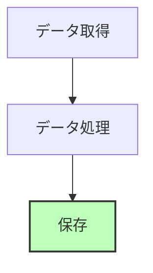

# Markdown の記述規約

リポジトリ内の Markdown (README・`docs/`・`AGENTS.md` など) に適用する規約。tree のコメント位置と全角記号は pre-commit フックが検査・修正するが、Mermaid の規約を検査するフックは無い (レビューで確認する)。

## フロー図は Mermaid

データフロー、処理手順、状態遷移、シーケンス、データモデルを図にするときは Mermaid 記法を使う。

- 罫線文字や矢印を並べた ASCII アート図は使わない。既存の文書で見つけたら Mermaid に置き換える
- ノード名は日本語でよい。ノード内の改行は `<br/>` を使う
- 重要なノードは色で区別してよい。データの保存先は `fill:#f9f`、処理中は `fill:#bbf`、完了は `fill:#bfb` を目安にする
- 書式は [Mermaid 公式ドキュメント](https://mermaid.js.org/) を参照する



## ディレクトリ構造は tree 形式

ディレクトリ構造とファイルツリーだけは Mermaid を使わず、` ```text ` フェンスの tree 形式で書く。Mermaid で表すと冗長になり、`tree` コマンドの出力とも見た目が揃わないため。

## tree 形式のコメント位置

tree にインラインコメント (`#`) を付けるときは、ブロック内のすべての `#` を同じ列に揃える。

- 最も長いパスの末尾から 2 スペース以上空けた列を基準にし、トップレベルの行も含めて全行をその列に合わせる
- 位置の調整はスペースだけで行い、タブは使わない
- 検査対象は ` ```text ` フェンスの中で、`├` / `└` / `│` を含むブロックだけ

良い例:

```text
data/
├── raw/                              # 生データ (Shift_JIS)
│   ├── .metadata/                    # メタデータ
│   └── *.csv                         # データファイル
└── processed/                        # 処理済みデータ (UTF-8)
```

悪い例 (コメント列がずれている。検査対象にならないよう `text` 以外のフェンスに入れている):

```
data/
├── raw/ # 生データ
│   ├── .metadata/ # メタデータ
└── processed/   # 処理済みデータ
```

`check-tree-comment-alignment` フック (`scripts/check_tree_comment_alignment.py`) が Markdown のコミット時に検査し、ずれていれば行番号と検出した列を表示してコミットを止める。その場合は報告された行の `#` を揃えてから再度コミットする。

```bash
uv run pre-commit run check-tree-comment-alignment --all-files
```

## 全角記号

Python と Markdown では、次の 4 文字を使わず半角で書く。日本語の文中でも括弧は半角 `()` にする。

| 全角 (コードポイント)     | 半角 |
| ------------------------- | ---- |
| 左括弧 U+FF08             | `(`  |
| 右括弧 U+FF09             | `)`  |
| コロン U+FF1A             | `:`  |
| 波ダッシュ・チルダ U+FF5E | `~`  |

`fix-fullwidth-symbols` フック (`scripts/fix_fullwidth_symbols.py`) が Python と Markdown のコミット時にこの 4 文字を半角へ自動で書き換える。フックはファイル全体を置換するため、規約の説明でもこれらの文字そのものは書かず、コードポイントで示す。Python では Ruff の RUF002 / RUF003 も同じ文字を検出する。

```bash
uv run pre-commit run fix-fullwidth-symbols --all-files
```
